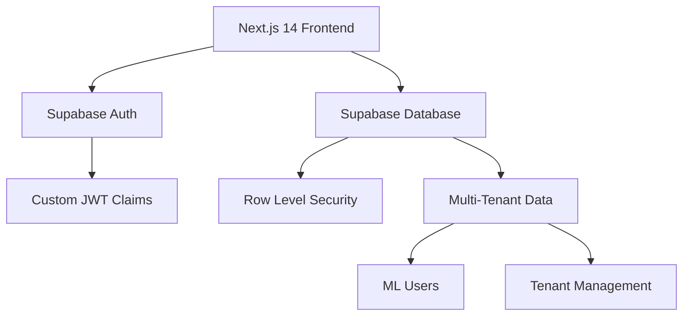

# 🚀 MercaFlow

> World-class MercadoLibre integration platform with enterprise-grade multi-tenancy

[](https://mercaflow.vercel.app)
[](https://www.typescriptlang.org/)
[](https://nextjs.org/)
[](https://supabase.com/)
[](./LICENSE)

## 🌟 Overview

MercaFlow is a **world-class SaaS platform** that provides enterprise-grade integration with MercadoLibre's ecosystem. Built with modern architecture patterns and security-first principles, specifically designed for the **Brazilian market**.

### ✨ Key Features

- 🔐 **Enterprise RBAC** - 5 hierarchical roles with 64 granular permissions
- 🏢 **Multi-Tenant Architecture** - Complete tenant isolation and security  
- 🚀 **Modern Stack** - Next.js 14, TypeScript, Supabase SSR
- 🔒 **Security First** - Row Level Security, Custom JWT Claims
- 📊 **Real-time Analytics** - Advanced ML user insights
- 🇧🇷 **Brazil Focused** - Localized for Brazilian market

## 🚀 Quick Start

```bash
# Clone repository
git clone https://github.com/antoniovbraz/mercaflow.git
cd mercaflow

# Install dependencies
npm install

# Setup environment
cp .env.example .env.local
# Add your Supabase credentials to .env.local

# Run development server
npm run dev
```

Visit [http://localhost:3000](http://localhost:3000) to see the application.

## 📚 Documentation

### 🇧🇷 Portuguese Documentation

All technical documentation is available in Portuguese to better serve our Brazilian market:

- [📖 Guias Completos](./docs/pt/) - Complete guides in Portuguese
- [🏗️ Arquitetura](./docs/pt/arquitetura/) - System architecture
- [🔐 Segurança](./docs/pt/seguranca/) - Security and RBAC
- [⚙️ Desenvolvimento](./docs/pt/desenvolvimento/) - Development guides
- [🚀 Deploy](./docs/pt/deploy/) - Deployment guides

### 🌍 International

- [Contributing](./CONTRIBUTING.md) - How to contribute to the project

## 🏗️ Architecture



### Tech Stack

- **Frontend**: Next.js 14, TypeScript, Tailwind CSS
- **Backend**: Supabase (PostgreSQL, Auth, Realtime)
- **Authentication**: Supabase SSR with Custom Claims
- **Security**: RLS Policies, RBAC System
- **Deployment**: Vercel (Frontend), Supabase (Backend)

## 🔐 Security

- **Row Level Security (RLS)** - 17+ policies protecting all data
- **Role-Based Access Control** - Granular permission system
- **Multi-tenant Isolation** - Complete data separation
- **Custom JWT Claims** - Role-based authorization
- **Audit Trail** - Complete action logging

## 🌍 Multi-Tenancy

MercaFlow supports **complete multi-tenancy** with:

- **Tenant Isolation** - Data completely separated by tenant
- **Custom Branding** - Per-tenant logos and colors
- **Subscription Plans** - Free, Starter, Professional, Enterprise
- **User Management** - Per-tenant user roles and permissions

## 📊 Performance

- **First Load JS**: 87.7 kB
- **Build Time**: ~30 seconds
- **Lighthouse Score**: 95+ (Performance, Accessibility, SEO)
- **Database Queries**: Optimized with indexes and RLS

## 🤝 Contributing

We welcome contributions! Please see our [Contributing Guide](./CONTRIBUTING.md) for details.

### Development Workflow

1. Fork the repository
2. Create a feature branch
3. Make your changes
4. Add tests
5. Submit a pull request

## 📝 License

This project is licensed under the MIT License - see the [LICENSE](LICENSE) file for details.

## 🆘 Support

- 📖 [Documentation](./docs/pt/)
- 🐛 [Issues](https://github.com/antoniovbraz/mercaflow/issues)
- 💬 [Discussions](https://github.com/antoniovbraz/mercaflow/discussions)

## 🏆 Status

**Production Ready** ✅  
**World-Class Standards** ✅  
**Enterprise Grade** ✅  

---

Built with ❤️ for the Brazilian market by [Antonio Braz](https://github.com/antoniovbraz)