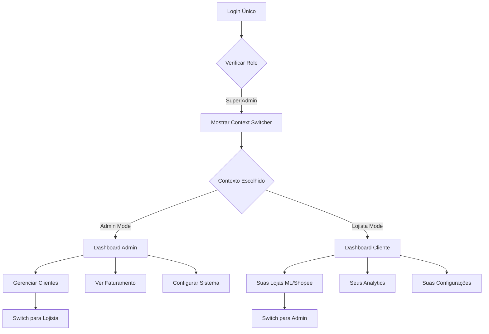

# 🔐 SUPER ADMIN SETUP GUIDE
## Configuração do Proprietário da Plataforma Merca Flow

**Versão**: 1.0  
**Data**: 01/10/2025  
**Proprietário**: Platform Owner  
**Ambiente**: Production Setup

---

## 🎯 RESUMO EXECUTIVO

Este documento define como você, como proprietário da plataforma Merca Flow, será configurado como Super Admin com controle total sobre todos os clientes, faturamento e sistema.

### Hierarquia de Permissões
```
Super Admin (VOCÊ) → Platform Admins → Customer Admins → Customer Users
```

---

## 🏗️ CONFIGURAÇÃO INICIAL

### 1. Database Setup (Primeira Configuração)

```sql
-- =====================================================
-- SUPER ADMIN INITIAL SETUP
-- Execute APENAS UMA VEZ durante deploy inicial
-- =====================================================

-- 1. Criar seu usuário como Super Admin
INSERT INTO platform_owners (
    id,
    email,
    role,
    permissions,
    two_factor_enabled,
    created_at
) VALUES (
    gen_random_uuid(),
    'seu-email@exemplo.com',  -- ALTERE PARA SEU EMAIL
    'super_admin',
    '{
        "tenant_management": "*",
        "billing": "*",
        "system": "*",
        "analytics": "*",
        "support": "*"
    }'::jsonb,
    true,
    NOW()
);

-- 2. Criar política de super admin bypass
CREATE POLICY "super_admin_bypass_all" ON tenants
    FOR ALL TO authenticated
    USING (
        EXISTS (
            SELECT 1 FROM platform_owners 
            WHERE platform_owners.email = auth.email() 
            AND role = 'super_admin'
        )
    );

-- 3. Criar tenant pessoal para o proprietário
DO $$
DECLARE
    owner_id UUID;
    tenant_id UUID;
BEGIN
    -- Buscar ID do super admin
    SELECT id INTO owner_id FROM platform_owners WHERE role = 'super_admin' LIMIT 1;
    
    -- Criar tenant especial
    INSERT INTO tenants (
        id, name, slug, plan, status, owner_user_id, created_by, 
        billing_status, is_platform_owner_tenant
    ) VALUES (
        gen_random_uuid(), 'Suas Lojas Online', 'platform-owner-stores',
        'enterprise', 'active', owner_id, owner_id, 'exempt', true
    ) RETURNING id INTO tenant_id;
    
    -- Associar ao platform_owner
    UPDATE platform_owners 
    SET personal_tenant_id = tenant_id, personal_tenant_enabled = true
    WHERE id = owner_id;
END;
$$;

-- 4. Função helper para verificar super admin
CREATE OR REPLACE FUNCTION is_super_admin()
RETURNS BOOLEAN AS $$
BEGIN
    RETURN EXISTS (
        SELECT 1 FROM platform_owners 
        WHERE email = auth.email() 
        AND role = 'super_admin'
    );
END;
$$ LANGUAGE plpgsql SECURITY DEFINER;

-- 5. Função para alternar contexto
CREATE OR REPLACE FUNCTION get_user_context()
RETURNS TABLE(role TEXT, tenant_id UUID, is_platform_owner BOOLEAN) AS $$
BEGIN
    RETURN QUERY
    SELECT 
        po.role::TEXT,
        po.personal_tenant_id,
        true as is_platform_owner
    FROM platform_owners po 
    WHERE po.email = auth.email();
END;
$$ LANGUAGE plpgsql SECURITY DEFINER;
```

### 2. Environment Variables (.env.local)

```bash
# =====================================================
# SUPER ADMIN CONFIGURATION
# =====================================================

# Seu email como super admin (usado para bypass de RLS)
SUPER_ADMIN_EMAIL=seu-email@exemplo.com

# DUAL ROLE CONFIGURATION
PLATFORM_OWNER_TENANT_NAME="Suas Lojas Online"
PLATFORM_OWNER_TENANT_SLUG="platform-owner-stores"
ENABLE_DUAL_ROLE=true

# URL do admin dashboard (subdomínio separado recomendado)
ADMIN_DASHBOARD_URL=https://admin.mercaflow.com.br

# Chaves de API para funcionalidades admin
ADMIN_API_SECRET=sua-chave-super-secreta-aqui

# Configurações de segurança
ADMIN_2FA_REQUIRED=true
ADMIN_SESSION_TIMEOUT=3600

# Configurações de billing/pagamentos
STRIPE_ADMIN_WEBHOOK_SECRET=whsec_xxxxx
BILLING_ADMIN_EMAIL=billing@mercaflow.com.br
```

### 3. Super Admin Routes Protection

```typescript
// middleware.ts - Proteção de rotas admin
import { createMiddlewareClient } from '@supabase/auth-helpers-nextjs'
import { NextResponse } from 'next/server'
import type { NextRequest } from 'next/server'

export async function middleware(req: NextRequest) {
  const res = NextResponse.next()
  const supabase = createMiddlewareClient({ req, res })

  // Verificar se é rota admin
  if (req.nextUrl.pathname.startsWith('/admin')) {
    const { data: { session } } = await supabase.auth.getSession()
    
    if (!session) {
      return NextResponse.redirect(new URL('/login', req.url))
    }

    // Verificar se é super admin
    const { data: isAdmin } = await supabase.rpc('is_super_admin')
    
    if (!isAdmin) {
      return NextResponse.redirect(new URL('/unauthorized', req.url))
    }
  }

  return res
}

export const config = {
  matcher: ['/admin/:path*']
}
```

---

## 👤 DUAL ROLE: SUPER ADMIN + CUSTOMER

### Conceito: Uma Conta, Dois Papéis

**VOCÊ TERÁ UMA ÚNICA CONTA COM DOIS CONTEXTOS:**
- 🔧 **Modo Super Admin**: Gerencia toda a plataforma
- 🛍️ **Modo Lojista**: Usa a plataforma para suas lojas

### Implementação de Dual Role

```sql
-- Estrutura para suportar dual role
TABLE platform_owners {
  id: UUID PRIMARY KEY
  email: VARCHAR(255) UNIQUE
  role: user_role DEFAULT 'super_admin'
  permissions: JSONB
  
  -- NOVO: Tenant pessoal para uso como cliente
  personal_tenant_id: UUID REFERENCES tenants(id)
  personal_tenant_enabled: BOOLEAN DEFAULT false
  
  created_at: TIMESTAMP DEFAULT NOW()
  two_factor_enabled: BOOLEAN DEFAULT true
}

-- Tenant especial para o proprietário
INSERT INTO tenants (
  id,
  name,
  slug,
  plan,
  status,
  owner_user_id,
  created_by,
  billing_status,
  is_platform_owner_tenant
) VALUES (
  gen_random_uuid(),
  'Suas Lojas Online', -- Nome da sua empresa
  'platform-owner-stores',
  'enterprise', -- Plano premium grátis
  'active',
  (SELECT id FROM platform_owners WHERE role = 'super_admin' LIMIT 1),
  (SELECT id FROM platform_owners WHERE role = 'super_admin' LIMIT 1),
  'exempt', -- Isento de cobrança
  true -- Flag especial
);

-- Política especial para tenant do proprietário
CREATE POLICY "platform_owner_tenant_access" ON products
  FOR ALL USING (
    tenant_id IN (
      SELECT personal_tenant_id FROM platform_owners 
      WHERE id = auth.uid() AND role = 'super_admin'
    )
    OR 
    EXISTS (
      SELECT 1 FROM platform_owners 
      WHERE id = auth.uid() AND role = 'super_admin'
    )
  );
```

### Interface com Alternância de Contexto

```typescript
// components/ContextSwitcher.tsx
export const ContextSwitcher: React.FC = () => {
  const { user, context, switchContext } = useAuth()
  const [isAdmin, setIsAdmin] = useState(context === 'admin')
  
  if (!user?.isSuperAdmin) return null
  
  return (
    <div className="context-switcher">
      <div className="flex items-center space-x-3">
        <span className="text-sm font-medium">
          {isAdmin ? '🔧 Admin Mode' : '🛍️ Lojista Mode'}
        </span>
        
        <Toggle
          checked={isAdmin}
          onChange={(checked) => {
            setIsAdmin(checked)
            switchContext(checked ? 'admin' : 'customer')
          }}
        />
        
        <div className="text-xs text-gray-500">
          {isAdmin 
            ? 'Gerenciando toda a plataforma' 
            : 'Usando como cliente normal'
          }
        </div>
      </div>
    </div>
  )
}

// Layout principal com contexto
export default function RootLayout({ children }) {
  const { context } = useAuth()
  
  return (
    <div className="app-layout">
      <Header>
        <ContextSwitcher />
      </Header>
      
      {context === 'admin' ? (
        <AdminLayout>{children}</AdminLayout>
      ) : (
        <CustomerLayout>{children}</CustomerLayout>
      )}
    </div>
  )
}
```

### Fluxo de Experiência do Usuário



### Benefícios Práticos

**🎯 PARA VOCÊ COMO PROPRIETÁRIO:**
- ✅ Uma única conta, sem confusão
- ✅ Alternância instantânea entre contextos
- ✅ Plano Enterprise gratuito para suas lojas
- ✅ Isento de cobrança automática
- ✅ Testa a plataforma como usuário real
- ✅ Experiência completa de ambos os lados

**📊 COMO LOJISTA (Suas Lojas):**
- 🛍️ Conecta Mercado Livre e Shopee
- 📈 Analytics das suas vendas
- 🤖 IA para otimizar seus preços
- 🎨 Vitrine profissional personalizada
- 📱 Mobile-first para seus clientes
- 💰 Sem taxa de uso (isento)

**🔧 COMO ADMIN (Plataforma):**
- 👥 Gerencia todos os outros clientes
- 💰 Controla faturamento de terceiros
- 📊 Analytics da plataforma toda
- 🎧 Suporte a clientes
- ⚙️ Configurações do sistema

### Implementação de Billing Especial

```typescript
// lib/billing/platform-owner.ts
export class PlatformOwnerBilling {
  
  async checkBillingStatus(userId: string, tenantId: string) {
    // Verificar se é tenant do proprietário
    const { data: tenant } = await supabase
      .from('tenants')
      .select('is_platform_owner_tenant, billing_status')
      .eq('id', tenantId)
      .single()
    
    if (tenant?.is_platform_owner_tenant) {
      return {
        status: 'exempt',
        plan: 'enterprise',
        features: ALL_FEATURES_ENABLED,
        message: 'Conta do proprietário - Isento de cobrança'
      }
    }
    
    // Lógica normal para outros clientes
    return this.checkRegularBilling(tenantId)
  }
  
  async generateInvoice(tenantId: string) {
    const tenant = await this.getTenant(tenantId)
    
    if (tenant.is_platform_owner_tenant) {
      console.log('Skipping invoice for platform owner tenant')
      return { status: 'exempt', amount: 0 }
    }
    
    // Gerar fatura normal para outros clientes
    return this.generateRegularInvoice(tenantId)
  }
}
```

---

## 🎛️ FUNCIONALIDADES DO SUPER ADMIN

### 1. Dashboard Principal (`/admin/dashboard`)

```typescript
// app/admin/dashboard/page.tsx
export default async function AdminDashboard() {
  const stats = await getPlateformStats()
  
  return (
    <div className="admin-dashboard">
      <h1>🏢 Merca Flow - Super Admin</h1>
      
      {/* Métricas Principais */}
      <div className="grid grid-cols-4 gap-6">
        <StatCard 
          title="Total de Clientes" 
          value={stats.totalTenants}
          trend="+12%" 
        />
        <StatCard 
          title="MRR Total" 
          value={`R$ ${stats.totalMRR}`}
          trend="+8%" 
        />
        <StatCard 
          title="Churn Rate" 
          value={`${stats.churnRate}%`}
          trend="-2%" 
        />
        <StatCard 
          title="Support Tickets" 
          value={stats.openTickets}
          trend="stable" 
        />
      </div>

      {/* Ações Rápidas */}
      <QuickActions>
        <ActionCard 
          title="Criar Cliente" 
          href="/admin/tenants/new"
          icon="🏢" 
        />
        <ActionCard 
          title="Ver Suporte" 
          href="/admin/support"
          icon="🎧" 
        />
        <ActionCard 
          title="Analytics" 
          href="/admin/analytics"
          icon="📊" 
        />
      </QuickActions>
    </div>
  )
}
```

### 2. Gerenciamento de Clientes (`/admin/tenants`)

```typescript
// app/admin/tenants/page.tsx
export default async function TenantsManagement() {
  const tenants = await getAllTenants()
  
  return (
    <div>
      <div className="flex justify-between items-center">
        <h2>👥 Gerenciar Clientes</h2>
        <Button href="/admin/tenants/new">+ Novo Cliente</Button>
      </div>

      <DataTable>
        {tenants.map(tenant => (
          <TenantRow key={tenant.id}>
            <td>{tenant.name}</td>
            <td>{tenant.plan}</td>
            <td>R$ {tenant.mrr}</td>
            <td>
              <Badge variant={tenant.status}>
                {tenant.status}
              </Badge>
            </td>
            <td>
              <DropdownMenu>
                <MenuItem onClick={() => impersonateTenant(tenant.id)}>
                  🎭 Entrar como Cliente
                </MenuItem>
                <MenuItem href={`/admin/tenants/${tenant.id}`}>
                  ✏️ Editar
                </MenuItem>
                <MenuItem onClick={() => suspendTenant(tenant.id)}>
                  ⏸️ Suspender
                </MenuItem>
              </DropdownMenu>
            </td>
          </TenantRow>
        ))}
      </DataTable>
    </div>
  )
}
```

### 3. Sistema de Impersonação

```typescript
// lib/impersonation.ts
export async function impersonateTenant(tenantId: string) {
  // Verificar se é super admin
  const { data: isAdmin } = await supabase.rpc('is_super_admin')
  if (!isAdmin) throw new Error('Unauthorized')

  // Buscar dados do tenant
  const { data: tenant } = await supabase
    .from('tenants')
    .select('owner_user_id, name')
    .eq('id', tenantId)
    .single()

  // Gerar link de impersonação
  const { data } = await supabase.auth.admin.generateLink({
    type: 'magiclink',
    email: tenant.owner_email,
    options: {
      data: { 
        impersonated_by: 'super_admin',
        original_tenant: tenantId 
      },
      redirectTo: `${process.env.NEXT_PUBLIC_APP_URL}/dashboard?impersonated=true`
    }
  })

  // Abrir em nova aba
  window.open(data.properties.action_link, '_blank')
}
```

### 4. Billing & Revenue Management

```typescript
// app/admin/billing/page.tsx
export default function BillingManagement() {
  return (
    <div>
      <h2>💰 Faturamento & Revenue</h2>
      
      {/* Revenue Overview */}
      <RevenueChart />
      
      {/* Subscription Management */}
      <SubscriptionTable>
        {subscriptions.map(sub => (
          <SubscriptionRow key={sub.id}>
            <td>{sub.tenant_name}</td>
            <td>{sub.plan}</td>
            <td>R$ {sub.amount}</td>
            <td>{sub.status}</td>
            <td>
              <Button onClick={() => modifySubscription(sub.id)}>
                Modificar
              </Button>
            </td>
          </SubscriptionRow>
        ))}
      </SubscriptionTable>
      
      {/* Quick Actions */}
      <div className="grid grid-cols-3 gap-4">
        <ActionCard title="Aplicar Desconto" />
        <ActionCard title="Gerar Fatura" />
        <ActionCard title="Relatório Revenue" />
      </div>
    </div>
  )
}
```

---

## 🔧 OPERAÇÕES ADMINISTRATIVAS

### 1. Scripts de Manutenção

```bash
# scripts/admin-operations.sh
#!/bin/bash

# =====================================================
# SUPER ADMIN MAINTENANCE SCRIPTS
# =====================================================

# Criar novo cliente via CLI
create_tenant() {
    echo "Creating new tenant: $1"
    psql $DATABASE_URL -c "
        INSERT INTO tenants (name, slug, plan, status, created_by) 
        VALUES ('$1', '$2', 'pro', 'active', 
            (SELECT id FROM platform_owners WHERE role = 'super_admin' LIMIT 1)
        );
    "
}

# Suspender cliente
suspend_tenant() {
    echo "Suspending tenant: $1"
    psql $DATABASE_URL -c "
        UPDATE tenants SET status = 'suspended' WHERE slug = '$1';
    "
}

# Backup de dados de cliente específico
backup_tenant_data() {
    echo "Backing up tenant data: $1"
    pg_dump $DATABASE_URL --data-only --table=products --table=analytics_events \
        --where="tenant_id='$1'" > "backup_tenant_$1_$(date +%Y%m%d).sql"
}

# Relatório de uso
usage_report() {
    echo "Generating usage report..."
    psql $DATABASE_URL -c "
        SELECT 
            t.name,
            t.plan,
            COUNT(p.id) as products,
            COUNT(ae.id) as events,
            t.created_at
        FROM tenants t
        LEFT JOIN products p ON p.tenant_id = t.id
        LEFT JOIN analytics_events ae ON ae.tenant_id = t.id
        GROUP BY t.id
        ORDER BY events DESC;
    "
}
```

### 2. Monitoring & Alerts

```typescript
// lib/admin-monitoring.ts
export class AdminMonitoring {
  
  // Alertas críticos
  async checkCriticalAlerts() {
    const alerts = []
    
    // Verificar clientes com muitos erros
    const errorClients = await supabase
      .from('error_logs')
      .select('tenant_id, count(*)')
      .gte('created_at', new Date(Date.now() - 24*60*60*1000))
      .group('tenant_id')
      .having('count > 100')
    
    if (errorClients.data?.length > 0) {
      alerts.push({
        type: 'high_error_rate',
        message: `${errorClients.data.length} clientes com alta taxa de erro`,
        severity: 'critical'
      })
    }
    
    // Verificar revenue drop
    const revenueToday = await calculateDailyRevenue()
    const revenueYesterday = await calculateDailyRevenue(-1)
    
    if (revenueToday < revenueYesterday * 0.8) {
      alerts.push({
        type: 'revenue_drop',
        message: `Revenue caiu ${((1 - revenueToday/revenueYesterday) * 100).toFixed(1)}%`,
        severity: 'high'
      })
    }
    
    return alerts
  }
  
  // Métricas de saúde da plataforma
  async getPlatformHealth() {
    return {
      uptime: await getSystemUptime(),
      activeUsers: await getActiveUsersCount(),
      errorRate: await calculateErrorRate(),
      avgResponseTime: await getAvgResponseTime(),
      databaseSize: await getDatabaseSize()
    }
  }
}
```

---

## 🚀 DEPLOYMENT & SETUP

### 1. Checklist de Configuração Inicial

```markdown
## Super Admin Setup Checklist

### Database
- [ ] Executar script de criação do super admin
- [ ] Configurar RLS policies
- [ ] Testar funções helper
- [ ] Criar backups iniciais

### Application
- [ ] Configurar environment variables
- [ ] Implementar middleware de proteção
- [ ] Criar rotas admin
- [ ] Testar sistema de impersonação

### Security
- [ ] Configurar 2FA obrigatório
- [ ] Implementar rate limiting para admin
- [ ] Configurar logs de auditoria
- [ ] Testar políticas de acesso

### Monitoring
- [ ] Configurar alertas críticos
- [ ] Implementar health checks
- [ ] Configurar logs estruturados
- [ ] Testar sistema de backup

### Business Operations
- [ ] Configurar integração de billing
- [ ] Implementar relatórios de revenue
- [ ] Configurar suporte ao cliente
- [ ] Documentar processos operacionais
```

### 2. Comandos de Deploy

```bash
# Deploy inicial com configuração de super admin
npm run build
npm run db:migrate
npm run admin:setup  # Script customizado para setup inicial
npm run deploy:production

# Verificar se super admin foi criado corretamente
npm run admin:verify
```

---

## 📞 SUPORTE & MANUTENÇÃO

### Contatos de Emergência
- **Super Admin**: seu-email@exemplo.com
- **Backup Admin**: backup-admin@exemplo.com
- **Technical Support**: suporte@mercaflow.com.br

### Logs de Auditoria
Todas as ações de super admin são logadas em `admin_audit_logs` para conformidade e segurança.

### Backup Strategy
- **Diário**: Backup completo da base de dados
- **Semanal**: Backup de arquivos e configurações
- **Mensal**: Backup completo offsite

---

*Este documento contém informações sensíveis e deve ser mantido em local seguro. Acesso restrito ao proprietário da plataforma.*