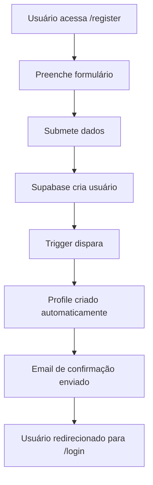
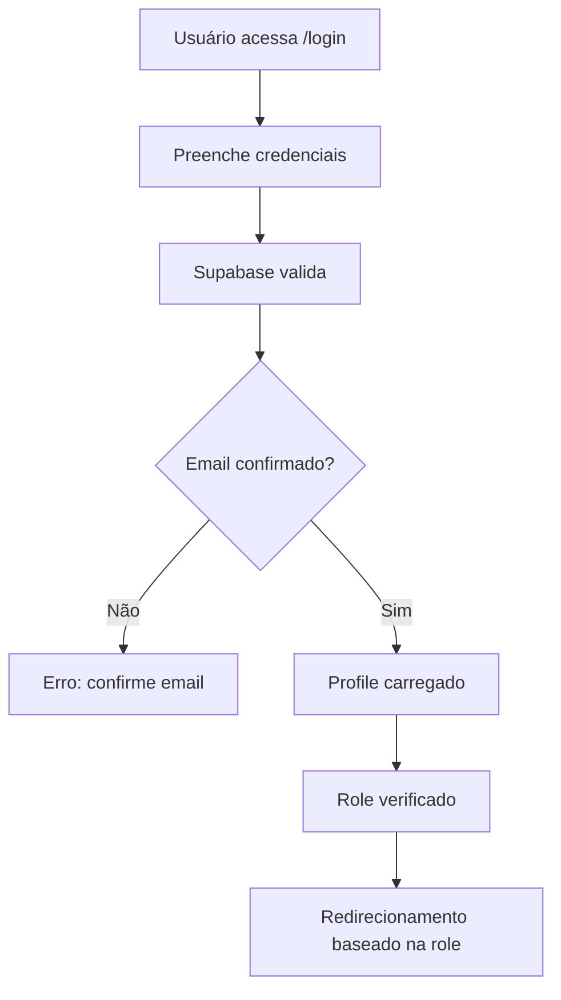

# Arquitetura do Sistema de Autenticação Profissional

## Visão Geral

O MercaFlow implementa uma arquitetura de autenticação enterprise-grade baseada em Supabase, com sistema multi-tenant completo, RBAC (Role-Based Access Control) hierárquico, e monitoramento estruturado.

## Componentes Principais

### 1. Sistema de Autenticação (Supabase Auth)

#### Funcionalidades

- **Registro de usuários** com validação de email obrigatória
- **Login seguro** com JWT tokens
- **Recuperação de senha** via email
- **Sessões persistentes** com refresh automático

#### Fluxo de Autenticação

```text
1. Usuário se registra → Email de confirmação enviado
2. Usuário confirma email → Profile criado automaticamente
3. Sistema atribui role padrão ('user')
4. Usuário pode fazer login normalmente
```

### 2. Sistema Multi-Tenant

#### Estrutura de Dados

```sql
-- Tabela principal de tenants
CREATE TABLE tenants (
  id UUID PRIMARY KEY DEFAULT gen_random_uuid(),
  name TEXT NOT NULL,
  slug TEXT UNIQUE NOT NULL,
  owner_id UUID REFERENCES auth.users(id),
  settings JSONB DEFAULT '{}',
  created_at TIMESTAMPTZ DEFAULT NOW(),
  updated_at TIMESTAMPTZ DEFAULT NOW()
);

-- Relacionamento usuário-tenant
CREATE TABLE tenant_users (
  id UUID PRIMARY KEY DEFAULT gen_random_uuid(),
  tenant_id UUID REFERENCES tenants(id) ON DELETE CASCADE,
  user_id UUID REFERENCES auth.users(id) ON DELETE CASCADE,
  role TEXT CHECK (role IN ('owner', 'admin', 'member')),
  created_at TIMESTAMPTZ DEFAULT NOW(),
  UNIQUE(tenant_id, user_id)
);
```

#### Isolamento de Dados

- **Row Level Security (RLS)** ativo em todas as tabelas
- Dados completamente isolados por tenant
- Usuários só acessam dados do seu tenant

### 3. Sistema RBAC Hierárquico

#### Hierarquia de Roles

```text
super_admin (nível mais alto)
├── admin (pode gerenciar tenants)
└── user (usuário padrão)
```

#### Implementação

```typescript
// Função de verificação hierárquica
export async function hasRole(requiredRole: string): Promise<boolean> {
  const profile = await requireAuth()
  const roleHierarchy = {
    'user': 1,
    'admin': 2,
    'super_admin': 3
  }
  return roleHierarchy[profile.role] >= roleHierarchy[requiredRole]
}
```

### 4. Sistema de Logging Estruturado

#### Schema `auth_system`

```sql
-- Schema dedicado para logging
CREATE SCHEMA auth_system;

-- Tabela de eventos de autenticação
CREATE TABLE auth_system.auth_events (
  id UUID PRIMARY KEY DEFAULT gen_random_uuid(),
  user_id UUID REFERENCES auth.users(id),
  event_type TEXT NOT NULL,
  metadata JSONB DEFAULT '{}',
  ip_address INET,
  user_agent TEXT,
  created_at TIMESTAMPTZ DEFAULT NOW()
);

-- Tabela de erros do sistema
CREATE TABLE auth_system.error_logs (
  id UUID PRIMARY KEY DEFAULT gen_random_uuid(),
  error_type TEXT NOT NULL,
  error_message TEXT NOT NULL,
  stack_trace TEXT,
  context JSONB DEFAULT '{}',
  created_at TIMESTAMPTZ DEFAULT NOW()
);
```

#### Views de Monitoramento

```sql
-- Status de criação de usuários
CREATE VIEW auth_system.user_creation_status AS
SELECT
  u.id,
  u.email,
  u.created_at,
  u.email_confirmed_at,
  p.full_name,
  p.role,
  CASE
    WHEN p.id IS NOT NULL THEN 'profile_created'
    ELSE 'profile_pending'
  END as status
FROM auth.users u
LEFT JOIN public.profiles p ON u.id = p.id;

-- Estatísticas de autenticação
CREATE VIEW auth_system.auth_stats AS
SELECT
  event_type,
  COUNT(*) as total_events,
  COUNT(DISTINCT user_id) as unique_users,
  MAX(created_at) as last_event
FROM auth_system.auth_events
GROUP BY event_type;
```

### 5. Error Handling Robusto

#### Estratégias Implementadas
- **Try-catch abrangente** em todas as operações críticas
- **Logging estruturado** de todos os erros
- **Fallbacks seguros** para operações que podem falhar
- **Mensagens de erro** amigáveis para o usuário

#### Exemplo de Implementação
```typescript
export async function safeAuthOperation(operation: () => Promise<any>) {
  try {
    const result = await operation()

    // Log sucesso
    await logAuthEvent('operation_success', { operation: operation.name })

    return result
  } catch (error) {
    // Log erro estruturado
    await logError('auth_operation_failed', error, {
      operation: operation.name,
      userId: getCurrentUserId()
    })

    // Re-throw com mensagem amigável
    throw new Error('Operação falhou. Tente novamente.')
  }
}
```

## Fluxos de Usuário

### Fluxo de Registro


### Fluxo de Login


## Segurança

### Row Level Security (RLS)
```sql
-- Políticas RLS para profiles
ALTER TABLE profiles ENABLE ROW LEVEL SECURITY;

CREATE POLICY "Users can view own profile" ON profiles
  FOR SELECT USING (auth.uid() = id);

CREATE POLICY "Users can update own profile" ON profiles
  FOR UPDATE USING (auth.uid() = id);

-- Políticas para tenants
CREATE POLICY "Tenant members can view tenant data" ON tenants
  FOR SELECT USING (
    EXISTS (
      SELECT 1 FROM tenant_users
      WHERE tenant_id = tenants.id
      AND user_id = auth.uid()
    )
  );
```

### Proteção contra Ataques Comuns
- **Rate limiting** nas operações de auth
- **Validação de entrada** em todos os formulários
- **Sanitização** de dados do usuário
- **Timeouts** em operações de banco

## Monitoramento e Observabilidade

### Métricas Principais
- Taxa de sucesso de registro
- Tempo médio de criação de profile
- Número de erros por tipo
- Distribuição de roles por tenant

### Alertas Configurados
- Aumento súbito de erros de autenticação
- Profiles não criados após registro
- Tentativas de acesso não autorizado

## Manutenção e Operações

### Backup e Recovery
- Backups automáticos diários
- Point-in-time recovery disponível
- Testes de restore mensais

### Monitoramento Contínuo
```sql
-- Query para verificar saúde do sistema
SELECT
  'user_creation_health' as metric,
  COUNT(*) as total_users,
  COUNT(CASE WHEN email_confirmed_at IS NOT NULL THEN 1 END) as confirmed_users,
  COUNT(CASE WHEN p.id IS NOT NULL THEN 1 END) as profiles_created
FROM auth.users u
LEFT JOIN public.profiles p ON u.id = p.id;
```

## Próximos Passos

### Melhorias Planejadas
1. **Autenticação multifator (MFA)**
2. **Single Sign-On (SSO)** com provedores externos
3. **Auditoria detalhada** de todas as operações
4. **Cache distribuído** para melhor performance

### Escalabilidade
- **Database sharding** por tenant para grandes volumes
- **CDN** para assets estáticos
- **Load balancing** automático
- **Auto-scaling** baseado em métricas

---

## Conclusão

Esta arquitetura profissional garante:
- **Segurança enterprise-grade** com isolamento completo de dados
- **Escalabilidade** para milhares de tenants
- **Observabilidade** completa do sistema
- **Manutenibilidade** com código estruturado e documentado
- **Confiabilidade** com error handling robusto e monitoring

O sistema está pronto para produção e pode suportar o crescimento do MercaFlow como plataforma SaaS de sucesso.