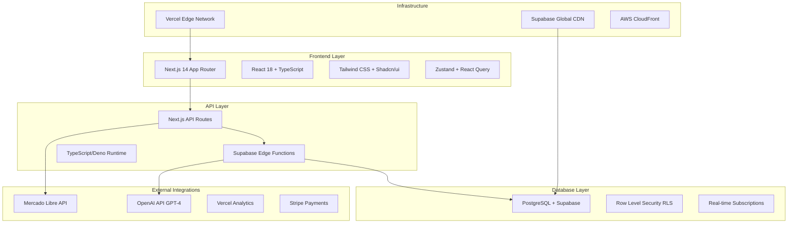

# 🏗️ TECHNICAL ARCHITECTURE - Merca Flow

## Arquitetura Técnica Detalhada

**Versão**: 1.0  
**Data**: 02/10/2025  
**Responsável**: Solution Architecture Team  
**Escopo**: Stack técnico completo da plataforma

---

## 🎯 VISÃO GERAL DA ARQUITETURA

### Stack Technology Overview



### 🏢 **Multi-Tenant Architecture**

**TENANT ISOLATION STRATEGY:**
- **Database Level**: Row Level Security (RLS) policies
- **Application Level**: Middleware tenant context
- **API Level**: Tenant-scoped queries automáticas
- **UI Level**: Tenant-specific theming e branding

**SCALABILITY APPROACH:**
- **Shared Database**: Single schema, isolated by tenant_id
- **Shared Application**: Multi-tenant aware routing
- **Edge Deployment**: Global distribution via Vercel
- **Caching Strategy**: Redis com tenant-specific keys

---

## 🛠️ DETALHAMENTO TÉCNICO

### 💻 **Frontend Architecture**

**NEXT.JS 14 APP ROUTER:**

```typescript
// app/layout.tsx - Root Layout
export default function RootLayout({
  children,
}: {
  children: React.ReactNode
}) {
  return (
    <html lang="pt-BR">
      <body className={inter.className}>
        <Providers>
          <TenantProvider>
            <AuthProvider>
              <Toaster />
              {children}
              <Analytics />
            </AuthProvider>
          </TenantProvider>
        </Providers>
      </body>
    </html>
  )
}

// app/dashboard/layout.tsx - Dashboard Layout
export default async function DashboardLayout({
  children,
}: {
  children: React.ReactNode
}) {
  const tenant = await getTenantContext()
  
  return (
    <div className="flex h-screen">
      <Sidebar tenant={tenant} />
      <main className="flex-1 overflow-y-auto">
        <Header tenant={tenant} />
        {children}
      </main>
    </div>
  )
}
```

**COMPONENT ARCHITECTURE:**

```typescript
// lib/types/global.ts
interface Tenant {
  id: string
  name: string
  slug: string
  plan: 'starter' | 'business' | 'enterprise'
  settings: TenantSettings
  theme: TenantTheme
}

interface TenantSettings {
  mercadolibre_user_id: string
  sync_enabled: boolean
  ai_pricing_enabled: boolean
  custom_domain?: string
}

// components/providers/TenantProvider.tsx
export const TenantProvider: React.FC<{ children: React.ReactNode }> = ({ 
  children 
}) => {
  const [tenant, setTenant] = useState<Tenant | null>(null)
  const [loading, setLoading] = useState(true)
  
  useEffect(() => {
    loadTenantFromUrl()
  }, [])
  
  const loadTenantFromUrl = async () => {
    const subdomain = extractSubdomain(window.location.hostname)
    const tenant = await fetchTenantBySlug(subdomain)
    setTenant(tenant)
    setLoading(false)
  }
  
  return (
    <TenantContext.Provider value={{ tenant, setTenant, loading }}>
      {children}
    </TenantContext.Provider>
  )
}
```

**STATE MANAGEMENT (ZUSTAND):**

```typescript
// stores/tenantStore.ts
interface TenantStore {
  tenant: Tenant | null
  products: Product[]
  analytics: Analytics
  setTenant: (tenant: Tenant) => void
  syncProducts: () => Promise<void>
  updateSettings: (settings: Partial<TenantSettings>) => Promise<void>
}

export const useTenantStore = create<TenantStore>((set, get) => ({
  tenant: null,
  products: [],
  analytics: null,
  
  setTenant: (tenant) => set({ tenant }),
  
  syncProducts: async () => {
    const { tenant } = get()
    if (!tenant) return
    
    try {
      const products = await syncMercadoLibreProducts(tenant.id)
      set({ products })
    } catch (error) {
      toast.error('Erro ao sincronizar produtos')
    }
  },
  
  updateSettings: async (settings) => {
    const { tenant } = get()
    if (!tenant) return
    
    const updated = await updateTenantSettings(tenant.id, settings)
    set({ tenant: { ...tenant, settings: updated } })
  }
}))

// stores/authStore.ts  
interface AuthStore {
  user: User | null
  session: Session | null
  isAdmin: boolean
  tenants: Tenant[]
  login: (email: string, password: string) => Promise<void>
  logout: () => Promise<void>
  switchTenant: (tenantId: string) => Promise<void>
}

export const useAuthStore = create<AuthStore>((set, get) => ({
  user: null,
  session: null,
  isAdmin: false,
  tenants: [],
  
  login: async (email, password) => {
    const { data, error } = await supabase.auth.signInWithPassword({
      email,
      password
    })
    
    if (error) throw error
    
    const tenants = await fetchUserTenants(data.user.id)
    set({ 
      user: data.user, 
      session: data.session,
      tenants,
      isAdmin: await checkIfSuperAdmin(data.user.email)
    })
  },
  
  switchTenant: async (tenantId) => {
    const tenant = get().tenants.find(t => t.id === tenantId)
    if (tenant) {
      useTenantStore.getState().setTenant(tenant)
      router.push(`https://${tenant.slug}.mercaflow.com.br/dashboard`)
    }
  }
}))
```

### 🔗 **API Architecture**

**NEXT.JS API ROUTES:**

```typescript
// app/api/tenants/[tenantId]/products/route.ts
export async function GET(
  request: Request,
  { params }: { params: { tenantId: string } }
) {
  try {
    // Validar autenticação
    const user = await getCurrentUser(request)
    if (!user) {
      return NextResponse.json({ error: 'Unauthorized' }, { status: 401 })
    }
    
    // Validar acesso ao tenant
    const hasAccess = await validateTenantAccess(user.id, params.tenantId)
    if (!hasAccess) {
      return NextResponse.json({ error: 'Forbidden' }, { status: 403 })
    }
    
    // Buscar produtos
    const products = await getProductsByTenant(params.tenantId)
    
    return NextResponse.json({ products })
  } catch (error) {
    return NextResponse.json(
      { error: 'Internal Server Error' }, 
      { status: 500 }
    )
  }
}

export async function POST(
  request: Request,
  { params }: { params: { tenantId: string } }
) {
  try {
    const body = await request.json()
    const { product } = body
    
    // Validações
    const user = await getCurrentUser(request)
    await validateTenantAccess(user.id, params.tenantId)
    
    // Criar produto
    const newProduct = await createProduct({
      ...product,
      tenant_id: params.tenantId,
      created_by: user.id
    })
    
    // Sincronizar com ML (background job)
    await enqueueMercadoLibreSync(newProduct.id)
    
    return NextResponse.json({ product: newProduct }, { status: 201 })
  } catch (error) {
    return NextResponse.json(
      { error: 'Failed to create product' }, 
      { status: 400 }
    )
  }
}
```

**SUPABASE EDGE FUNCTIONS:**

```typescript
// supabase/functions/sync-mercadolibre/index.ts
import { serve } from "https://deno.land/std@0.168.0/http/server.ts"
import { createClient } from 'https://esm.sh/@supabase/supabase-js@2'

serve(async (req) => {
  try {
    const { tenantId } = await req.json()
    
    // Inicializar Supabase client
    const supabase = createClient(
      Deno.env.get('SUPABASE_URL') ?? '',
      Deno.env.get('SUPABASE_SERVICE_ROLE_KEY') ?? ''
    )
    
    // Buscar configurações do tenant
    const { data: tenant, error: tenantError } = await supabase
      .from('tenants')
      .select('settings')
      .eq('id', tenantId)
      .single()
    
    if (tenantError) throw tenantError
    
    // Sincronizar com ML API
    const mlProducts = await fetchMercadoLibreProducts(
      tenant.settings.mercadolibre_user_id
    )
    
    // Processar e salvar produtos
    for (const mlProduct of mlProducts) {
      await upsertProduct({
        tenant_id: tenantId,
        ml_product_id: mlProduct.id,
        title: mlProduct.title,
        price: mlProduct.price,
        images: mlProduct.pictures,
        description: mlProduct.description,
        category: mlProduct.category_id,
        sync_status: 'synced',
        last_sync: new Date().toISOString()
      })
    }
    
    return new Response(
      JSON.stringify({ 
        success: true, 
        synced: mlProducts.length 
      }),
      { 
        headers: { "Content-Type": "application/json" },
        status: 200 
      }
    )
  } catch (error) {
    return new Response(
      JSON.stringify({ error: error.message }),
      { 
        headers: { "Content-Type": "application/json" },
        status: 500 
      }
    )
  }
})

// Helper functions
async function fetchMercadoLibreProducts(userId: string) {
  const response = await fetch(
    `https://api.mercadolibre.com/users/${userId}/items/search?access_token=${ML_ACCESS_TOKEN}`,
    {
      headers: {
        'Authorization': `Bearer ${ML_ACCESS_TOKEN}`,
        'Content-Type': 'application/json'
      }
    }
  )
  
  if (!response.ok) {
    throw new Error(`ML API Error: ${response.status}`)
  }
  
  const data = await response.json()
  return data.results
}
```

### 🗄️ **Database Architecture**

**POSTGRESQL SCHEMA:**

```sql
-- =====================================================
-- CORE TABLES
-- =====================================================

-- Tenants (Multi-tenant isolation)
CREATE TABLE tenants (
    id UUID PRIMARY KEY DEFAULT gen_random_uuid(),
    name VARCHAR(255) NOT NULL,
    slug VARCHAR(100) UNIQUE NOT NULL,
    plan VARCHAR(50) NOT NULL DEFAULT 'starter',
    status VARCHAR(50) NOT NULL DEFAULT 'active',
    settings JSONB DEFAULT '{}',
    theme JSONB DEFAULT '{}',
    owner_user_id UUID REFERENCES auth.users(id),
    created_by UUID REFERENCES auth.users(id),
    created_at TIMESTAMP WITH TIME ZONE DEFAULT NOW(),
    updated_at TIMESTAMP WITH TIME ZONE DEFAULT NOW(),
    
    -- Business fields
    billing_status VARCHAR(50) DEFAULT 'active',
    subscription_ends_at TIMESTAMP WITH TIME ZONE,
    trial_ends_at TIMESTAMP WITH TIME ZONE,
    is_platform_owner_tenant BOOLEAN DEFAULT FALSE,
    
    -- Constraints
    CONSTRAINT valid_plan CHECK (plan IN ('starter', 'business', 'enterprise')),
    CONSTRAINT valid_status CHECK (status IN ('active', 'inactive', 'suspended')),
    CONSTRAINT valid_billing CHECK (billing_status IN ('active', 'past_due', 'canceled', 'exempt'))
);

-- Products (Core business entity)
CREATE TABLE products (
    id UUID PRIMARY KEY DEFAULT gen_random_uuid(),
    tenant_id UUID NOT NULL REFERENCES tenants(id) ON DELETE CASCADE,
    
    -- ML Integration
    ml_product_id VARCHAR(50),
    ml_permalink VARCHAR(500),
    
    -- Product data
    title VARCHAR(255) NOT NULL,
    description TEXT,
    price DECIMAL(10,2) NOT NULL,
    original_price DECIMAL(10,2),
    currency VARCHAR(3) DEFAULT 'BRL',
    category VARCHAR(100),
    brand VARCHAR(100),
    condition VARCHAR(50) DEFAULT 'new',
    
    -- Media
    images JSONB DEFAULT '[]',
    videos JSONB DEFAULT '[]',
    
    -- Inventory
    stock_quantity INTEGER DEFAULT 0,
    stock_status VARCHAR(50) DEFAULT 'in_stock',
    
    -- SEO & Display
    slug VARCHAR(255),
    meta_title VARCHAR(255),
    meta_description TEXT,
    tags JSONB DEFAULT '[]',
    
    -- AI & Analytics
    ai_optimized_title VARCHAR(255),
    ai_optimized_price DECIMAL(10,2),
    ai_score DECIMAL(3,2),
    
    -- Status & Sync
    status VARCHAR(50) DEFAULT 'active',
    sync_status VARCHAR(50) DEFAULT 'pending',
    sync_error TEXT,
    last_sync TIMESTAMP WITH TIME ZONE,
    
    -- Metadata
    created_at TIMESTAMP WITH TIME ZONE DEFAULT NOW(),
    updated_at TIMESTAMP WITH TIME ZONE DEFAULT NOW(),
    created_by UUID REFERENCES auth.users(id),
    
    -- Indexes
    UNIQUE(tenant_id, ml_product_id),
    UNIQUE(tenant_id, slug)
);

-- Analytics (Product performance tracking)
CREATE TABLE analytics_events (
    id UUID PRIMARY KEY DEFAULT gen_random_uuid(),
    tenant_id UUID NOT NULL REFERENCES tenants(id) ON DELETE CASCADE,
    product_id UUID REFERENCES products(id) ON DELETE CASCADE,
    
    -- Event data
    event_type VARCHAR(50) NOT NULL, -- 'view', 'click', 'conversion'
    event_data JSONB DEFAULT '{}',
    
    -- User context
    user_agent TEXT,
    ip_address INET,
    referrer VARCHAR(500),
    utm_source VARCHAR(100),
    utm_medium VARCHAR(100),
    utm_campaign VARCHAR(100),
    
    -- Geographic
    city VARCHAR(100),
    state VARCHAR(100),
    country VARCHAR(100),
    
    -- Timestamps
    timestamp TIMESTAMP WITH TIME ZONE DEFAULT NOW(),
    session_id UUID,
    
    -- Indexes for performance
    INDEX idx_analytics_tenant_date (tenant_id, timestamp),
    INDEX idx_analytics_product_date (product_id, timestamp),
    INDEX idx_analytics_event_type (event_type, timestamp)
);

-- =====================================================
-- ROW LEVEL SECURITY POLICIES
-- =====================================================

-- Enable RLS on all tables
ALTER TABLE tenants ENABLE ROW LEVEL SECURITY;
ALTER TABLE products ENABLE ROW LEVEL SECURITY;
ALTER TABLE analytics_events ENABLE ROW LEVEL SECURITY;

-- Tenants: Users can only access their own tenants
CREATE POLICY "Users can access own tenants" ON tenants
    FOR ALL USING (
        owner_user_id = auth.uid() OR
        created_by = auth.uid() OR
        EXISTS (
            SELECT 1 FROM tenant_users 
            WHERE tenant_id = tenants.id 
            AND user_id = auth.uid()
        )
    );

-- Super admin bypass for tenants
CREATE POLICY "Super admin can access all tenants" ON tenants
    FOR ALL TO authenticated
    USING (
        EXISTS (
            SELECT 1 FROM platform_owners 
            WHERE email = auth.email() 
            AND role = 'super_admin'
        )
    );

-- Products: Tenant-scoped access
CREATE POLICY "Tenant scoped products" ON products
    FOR ALL USING (
        tenant_id IN (
            SELECT id FROM tenants 
            WHERE owner_user_id = auth.uid() OR
                  created_by = auth.uid() OR
                  EXISTS (
                      SELECT 1 FROM tenant_users 
                      WHERE tenant_id = tenants.id 
                      AND user_id = auth.uid()
                  )
        )
    );

-- Analytics: Tenant-scoped access
CREATE POLICY "Tenant scoped analytics" ON analytics_events
    FOR ALL USING (
        tenant_id IN (
            SELECT id FROM tenants 
            WHERE owner_user_id = auth.uid() OR
                  created_by = auth.uid() OR
                  EXISTS (
                      SELECT 1 FROM tenant_users 
                      WHERE tenant_id = tenants.id 
                      AND user_id = auth.uid()
                  )
        )
    );

-- =====================================================
-- FUNCTIONS & TRIGGERS
-- =====================================================

-- Update timestamp function
CREATE OR REPLACE FUNCTION update_updated_at_column()
RETURNS TRIGGER AS $$
BEGIN
    NEW.updated_at = NOW();
    RETURN NEW;
END;
$$ language 'plpgsql';

-- Apply to tables
CREATE TRIGGER update_tenants_updated_at 
    BEFORE UPDATE ON tenants 
    FOR EACH ROW EXECUTE FUNCTION update_updated_at_column();

CREATE TRIGGER update_products_updated_at 
    BEFORE UPDATE ON products 
    FOR EACH ROW EXECUTE FUNCTION update_updated_at_column();

-- Slug generation function
CREATE OR REPLACE FUNCTION generate_product_slug()
RETURNS TRIGGER AS $$
BEGIN
    IF NEW.slug IS NULL OR NEW.slug = '' THEN
        NEW.slug := slugify(NEW.title) || '-' || substring(NEW.id::text from 1 for 8);
    END IF;
    RETURN NEW;
END;
$$ language 'plpgsql';

CREATE TRIGGER generate_product_slug_trigger
    BEFORE INSERT OR UPDATE ON products
    FOR EACH ROW EXECUTE FUNCTION generate_product_slug();
```

### 🔄 **Real-time & Background Jobs**

**SUPABASE REAL-TIME:**

```typescript
// hooks/useRealtimeProducts.ts
export const useRealtimeProducts = (tenantId: string) => {
  const [products, setProducts] = useState<Product[]>([])
  
  useEffect(() => {
    if (!tenantId) return
    
    // Subscribe to real-time changes
    const subscription = supabase
      .channel(`products:tenant:${tenantId}`)
      .on(
        'postgres_changes',
        {
          event: '*',
          schema: 'public',
          table: 'products',
          filter: `tenant_id=eq.${tenantId}`
        },
        (payload) => {
          handleRealtimeChange(payload)
        }
      )
      .subscribe()
    
    return () => {
      subscription.unsubscribe()
    }
  }, [tenantId])
  
  const handleRealtimeChange = (payload: any) => {
    switch (payload.eventType) {
      case 'INSERT':
        setProducts(prev => [...prev, payload.new])
        toast.success('Novo produto sincronizado!')
        break
      case 'UPDATE':
        setProducts(prev => 
          prev.map(p => p.id === payload.new.id ? payload.new : p)
        )
        break
      case 'DELETE':
        setProducts(prev => 
          prev.filter(p => p.id !== payload.old.id)
        )
        break
    }
  }
  
  return { products, setProducts }
}
```

**BACKGROUND JOBS (EDGE FUNCTIONS):**

```typescript
// supabase/functions/ai-price-optimization/index.ts
serve(async (req) => {
  try {
    const { productId } = await req.json()
    
    // Buscar produto e dados de mercado
    const product = await getProduct(productId)
    const marketData = await getMarketData(product.category, product.title)
    
    // Chamar OpenAI para análise
    const aiResponse = await fetch('https://api.openai.com/v1/chat/completions', {
      method: 'POST',
      headers: {
        'Authorization': `Bearer ${OPENAI_API_KEY}`,
        'Content-Type': 'application/json'
      },
      body: JSON.stringify({
        model: 'gpt-4',
        messages: [{
          role: 'system',
          content: `Você é um especialista em pricing para Mercado Livre. 
                   Analise o produto e dados de mercado para sugerir o preço ótimo.`
        }, {
          role: 'user',
          content: `
            Produto: ${product.title}
            Preço atual: R$ ${product.price}
            Categoria: ${product.category}
            Dados do mercado: ${JSON.stringify(marketData)}
            
            Sugira o preço ótimo e justificativa.
          `
        }],
        temperature: 0.3
      })
    })
    
    const aiResult = await aiResponse.json()
    const suggestion = parsePriceSuggestion(aiResult.choices[0].message.content)
    
    // Atualizar produto com sugestão da IA
    await updateProduct(productId, {
      ai_optimized_price: suggestion.price,
      ai_score: suggestion.confidence,
    })
    
    return new Response(JSON.stringify({ success: true, suggestion }))
  } catch (error) {
    return new Response(JSON.stringify({ error: error.message }), { status: 500 })
  }
})

// supabase/functions/sync-scheduler/index.ts - Cron job
serve(async (req) => {
  try {
    // Buscar todos os tenants ativos com sync habilitado
    const { data: tenants } = await supabase
      .from('tenants')
      .select('id, settings')
      .eq('status', 'active')
      .eq('settings->sync_enabled', true)
    
    // Disparar sync para cada tenant
    const syncPromises = tenants.map(tenant => 
      fetch('/functions/sync-mercadolibre', {
        method: 'POST',
        body: JSON.stringify({ tenantId: tenant.id })
      })
    )
    
    await Promise.all(syncPromises)
    
    return new Response(JSON.stringify({ 
      success: true, 
      synced: tenants.length 
    }))
  } catch (error) {
    return new Response(JSON.stringify({ error: error.message }), { status: 500 })
  }
})
```

### 🛡️ **Security & Authentication**

**MIDDLEWARE DE SEGURANÇA:**

```typescript
// middleware.ts
import { createServerClient } from '@supabase/ssr'
import { NextResponse } from 'next/server'
import type { NextRequest } from 'next/server'

export async function middleware(req: NextRequest) {
  const res = NextResponse.next()
  const supabase = createMiddlewareClient({ req, res })
  
  // Refresh session if expired
  const { data: { session } } = await supabase.auth.getSession()
  
  // Protected routes
  if (req.nextUrl.pathname.startsWith('/dashboard')) {
    if (!session) {
      return NextResponse.redirect(new URL('/login', req.url))
    }
    
    // Tenant access validation
    const tenantSlug = extractTenantFromUrl(req.nextUrl.hostname)
    const hasAccess = await validateTenantAccess(session.user.id, tenantSlug)
    
    if (!hasAccess) {
      return NextResponse.redirect(new URL('/unauthorized', req.url))
    }
  }
  
  // Admin routes
  if (req.nextUrl.pathname.startsWith('/admin')) {
    if (!session) {
      return NextResponse.redirect(new URL('/login', req.url))
    }
    
    const isAdmin = await checkSuperAdminAccess(session.user.email)
    if (!isAdmin) {
      return NextResponse.redirect(new URL('/unauthorized', req.url))
    }
  }
  
  return res
}

export const config = {
  matcher: ['/dashboard/:path*', '/admin/:path*', '/api/:path*']
}
```

---

## 📊 PERFORMANCE & MONITORING

### 🚀 **Performance Optimization**

**CACHING STRATEGY:**

```typescript
// lib/cache/redis.ts
import { Redis } from '@upstash/redis'

const redis = new Redis({
  url: process.env.UPSTASH_REDIS_REST_URL!,
  token: process.env.UPSTASH_REDIS_REST_TOKEN!,
})

export async function getCachedProducts(tenantId: string) {
  const cached = await redis.get(`products:${tenantId}`)
  if (cached) return JSON.parse(cached as string)
  
  // Fetch from database
  const products = await fetchProductsFromDB(tenantId)
  
  // Cache for 5 minutes
  await redis.setex(`products:${tenantId}`, 300, JSON.stringify(products))
  
  return products
}

// components/ProductList.tsx - With React Query
export const ProductList: React.FC<{ tenantId: string }> = ({ tenantId }) => {
  const { data: products, isLoading, error } = useQuery({
    queryKey: ['products', tenantId],
    queryFn: () => fetchProducts(tenantId),
    staleTime: 5 * 60 * 1000, // 5 minutes
    refetchOnWindowFocus: false,
  })
  
  if (isLoading) return <ProductSkeleton />
  if (error) return <ErrorMessage error={error} />
  
  return (
    <div className="grid grid-cols-1 md:grid-cols-2 lg:grid-cols-3 gap-6">
      {products?.map(product => (
        <ProductCard key={product.id} product={product} />
      ))}
    </div>
  )
}
```

**IMAGE OPTIMIZATION:**

```typescript
// components/OptimizedImage.tsx
import Image from 'next/image'

export const OptimizedImage: React.FC<{
  src: string
  alt: string
  width: number
  height: number
  priority?: boolean
}> = ({ src, alt, width, height, priority = false }) => {
  return (
    <Image
      src={src}
      alt={alt}
      width={width}
      height={height}
      priority={priority}
      quality={85}
      placeholder="blur"
      blurDataURL="data:image/jpeg;base64,/9j/4AAQSkZJRgABAQAAAQABAAD/2wBDAAYEBQYFBAYGBQYHBwYIChAKCgkJChQODwwQFxQYGBcUFhYaHSUfGhsjHBYWICwgIyYnKSopGR8tMC0oMCUoKSj/2wBDAQcHBwoIChMKChMoGhYaKCgoKCgoKCgoKCgoKCg"
      className="rounded-lg object-cover"
      sizes="(max-width: 768px) 100vw, (max-width: 1200px) 50vw, 33vw"
    />
  )
}
```

### 📈 **Monitoring & Analytics**

**ERROR TRACKING:**

```typescript
// lib/monitoring/sentry.ts
import * as Sentry from "@sentry/nextjs"

Sentry.init({
  dsn: process.env.NEXT_PUBLIC_SENTRY_DSN,
  environment: process.env.NODE_ENV,
  tracesSampleRate: 1.0,
  
  beforeSend(event) {
    // Filter out specific errors
    if (event.exception) {
      const error = event.exception.values?.[0]
      if (error?.value?.includes('Network request failed')) {
        return null // Don't send network errors
      }
    }
    return event
  }
})

// utils/errorHandler.ts
export function handleError(error: Error, context?: string) {
  console.error(`Error ${context ? `in ${context}` : ''}:`, error)
  
  Sentry.captureException(error, {
    tags: { context },
    level: 'error'
  })
  
  // Show user-friendly message
  toast.error('Ops! Algo deu errado. Nossa equipe foi notificada.')
}
```

**PERFORMANCE MONITORING:**

```typescript
// lib/monitoring/performance.ts
export function trackPerformance(name: string, fn: () => Promise<any>) {
  return async (...args: any[]) => {
    const start = performance.now()
    
    try {
      const result = await fn.apply(this, args)
      const duration = performance.now() - start
      
      // Track to analytics
      analytics.track('Performance', {
        operation: name,
        duration: Math.round(duration),
        success: true
      })
      
      return result
    } catch (error) {
      const duration = performance.now() - start
      
      analytics.track('Performance', {
        operation: name,
        duration: Math.round(duration),
        success: false,
        error: error.message
      })
      
      throw error
    }
  }
}

// Usage
const fetchProducts = trackPerformance('fetchProducts', async (tenantId: string) => {
  const response = await fetch(`/api/tenants/${tenantId}/products`)
  return response.json()
})
```

---

## 🚀 DEPLOYMENT & DEVOPS

### 🏗️ **Build & Deployment**

**VERCEL CONFIGURATION:**

```json
// vercel.json
{
  "version": 2,
  "builds": [
    {
      "src": "package.json",
      "use": "@vercel/next"
    }
  ],
  "env": {
    "NEXT_PUBLIC_SUPABASE_URL": "@supabase-url",
    "NEXT_PUBLIC_SUPABASE_ANON_KEY": "@supabase-anon-key",
    "SUPABASE_SERVICE_ROLE_KEY": "@supabase-service-role-key",
    "OPENAI_API_KEY": "@openai-api-key",
    "MERCADOLIBRE_CLIENT_ID": "@ml-client-id",
    "MERCADOLIBRE_CLIENT_SECRET": "@ml-client-secret"
  },
  "functions": {
    "app/api/**/*.ts": {
      "runtime": "nodejs18.x"
    }
  },
  "rewrites": [
    {
      "source": "/admin/:path*",
      "destination": "/admin/:path*"
    },
    {
      "source": "/:path*",
      "destination": "/showcase/:path*",
      "has": [
        {
          "type": "host",
          "value": "(?<tenant>[^.]+)\\.mercaflow\\.com\\.br"
        }
      ]
    }
  ]
}
```

**ENVIRONMENT SETUP:**

```bash
# .env.local
NEXT_PUBLIC_SUPABASE_URL=https://your-project.supabase.co
NEXT_PUBLIC_SUPABASE_ANON_KEY=your-anon-key
SUPABASE_SERVICE_ROLE_KEY=your-service-role-key

OPENAI_API_KEY=sk-your-openai-key
MERCADOLIBRE_CLIENT_ID=your-ml-client-id
MERCADOLIBRE_CLIENT_SECRET=your-ml-client-secret

UPSTASH_REDIS_REST_URL=https://your-redis.upstash.io
UPSTASH_REDIS_REST_TOKEN=your-redis-token

NEXT_PUBLIC_SENTRY_DSN=https://your-sentry-dsn
```

### 🔄 **CI/CD Pipeline**

```yaml
# .github/workflows/deploy.yml
name: Deploy to Vercel

on:
  push:
    branches: [main]
  pull_request:
    branches: [main]

jobs:
  test:
    runs-on: ubuntu-latest
    steps:
      - uses: actions/checkout@v3
      - uses: actions/setup-node@v3
        with:
          node-version: '18'
          cache: 'npm'
      
      - run: npm ci
      - run: npm run lint
      - run: npm run type-check
      - run: npm run test
      
  deploy:
    needs: test
    runs-on: ubuntu-latest
    if: github.ref == 'refs/heads/main'
    
    steps:
      - uses: actions/checkout@v3
      - uses: amondnet/vercel-action@v25
        with:
          vercel-token: ${{ secrets.VERCEL_TOKEN }}
          vercel-org-id: ${{ secrets.VERCEL_ORG_ID }}
          vercel-project-id: ${{ secrets.VERCEL_PROJECT_ID }}
          vercel-args: '--prod'
```

---

## 📋 RESUMO TÉCNICO

### ✅ **Stack Decisions Rationale**

**NEXT.JS 14 + SUPABASE:**
- **Performance**: SSR + Edge computing
- **Developer Experience**: Type-safe, modern tooling  
- **Scalability**: Multi-tenant architecture
- **Cost**: Predictable pricing, auto-scaling

**POSTGRESQL + RLS:**
- **Security**: Row Level Security for tenant isolation
- **Performance**: Optimized queries with proper indexing
- **Reliability**: ACID compliance, backup/recovery
- **Flexibility**: JSON fields for dynamic data

**VERCEL + EDGE:**
- **Global**: CDN edge locations worldwide
- **Performance**: <100ms response times
- **Reliability**: 99.99% uptime SLA
- **Integration**: Native Next.js optimization

### 🎯 **Technical KPIs**

- **Performance**: <2s page load, <100ms API response
- **Uptime**: >99.9% availability
- **Security**: Zero data breaches, SOC 2 compliance
- **Scalability**: 10K+ concurrent users supported

### 🚀 **Next Technical Milestones**

1. **Q4 2025**: MVP deployment + monitoring
2. **Q1 2026**: Mobile PWA + offline support  
3. **Q2 2026**: Multi-marketplace integrations
4. **Q3 2026**: Advanced AI features + ML pipelines

---

**Arquitetura pronta para escalar de 0 → 10K clientes com performance enterprise** 🏗️🚀