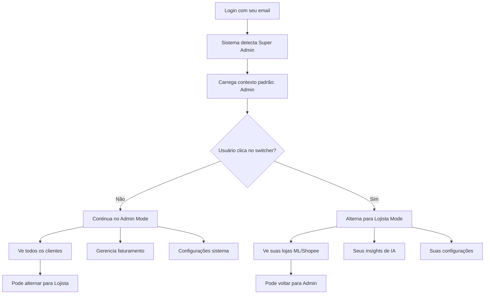

# 🔄 DUAL ROLE - GUIA VISUAL

## Como Funciona na Prática

### 🏠 Tela Principal - Context Switcher

```
┌─────────────────────────────────────────────────────────────┐
│ 🏢 Merca Flow                    [🔄 Admin Mode] [👤 Anton] │
├─────────────────────────────────────────────────────────────┤
│                                                             │
│  👋 Olá Anton! Você está em modo ADMINISTRADOR             │
│                                                             │
│  ┌─────────────────────────────────────────────────────┐   │
│  │ 🔄 ALTERNAR CONTEXTO                               │   │
│  │                                                     │   │
│  │ ● 🔧 Modo Admin     ○ 🛍️ Modo Lojista               │   │
│  │                                                     │   │
│  │ Atualmente: Gerenciando toda a plataforma          │   │
│  │ [ Alternar para suas lojas ]                       │   │
│  └─────────────────────────────────────────────────────┘   │
│                                                             │
│  📊 DASHBOARD ADMIN - PLATAFORMA TODA                      │
│  ┌─────────────┐ ┌─────────────┐ ┌─────────────┐          │
│  │ 👥 Clientes │ │ 💰 MRR      │ │ 🎧 Tickets  │          │
│  │    1,247    │ │ R$ 89.5K    │ │     23      │          │
│  └─────────────┘ └─────────────┘ └─────────────┘          │
│                                                             │
└─────────────────────────────────────────────────────────────┘
```

### 🛍️ Após Alternar para Modo Lojista

```
┌─────────────────────────────────────────────────────────────┐
│ 🏢 Merca Flow                  [🛍️ Lojista Mode] [👤 Anton] │
├─────────────────────────────────────────────────────────────┤
│                                                             │
│  👋 Bem-vindo às suas lojas, Anton!                        │
│                                                             │
│  ┌─────────────────────────────────────────────────────┐   │
│  │ 🔄 ALTERNAR CONTEXTO                               │   │
│  │                                                     │   │
│  │ ○ 🔧 Modo Admin     ● 🛍️ Modo Lojista               │   │
│  │                                                     │   │
│  │ Atualmente: Usando como cliente normal             │   │
│  │ [ Voltar para administração ]                      │   │
│  └─────────────────────────────────────────────────────┘   │
│                                                             │
│  📊 SUAS LOJAS - MERCADO LIVRE & SHOPEE                    │
│  ┌─────────────┐ ┌─────────────┐ ┌─────────────┐          │
│  │ 📱 ML Loja  │ │ 💰 Vendas   │ │ 👁️ Visitas  │          │
│  │   45 itens  │ │ R$ 2.8K     │ │    1,234    │          │
│  └─────────────┘ └─────────────┘ └─────────────┘          │
│                                                             │
│  🎯 INSIGHTS IA PARA SUAS LOJAS                            │
│  "Aumente o preço do produto X em 8% (+R$ 240/mês)"       │
│                                                             │
└─────────────────────────────────────────────────────────────┘
```

## 🔐 Configuração de Conta Única

### Estrutura no Banco de Dados

```
platform_owners (Sua conta)
├── id: uuid
├── email: "seu-email@exemplo.com"
├── role: "super_admin"
└── personal_tenant_id: uuid ──┐
                                │
tenants (Suas lojas)           │
├── id: uuid ◄─────────────────┘
├── name: "Suas Lojas Online"
├── slug: "platform-owner-stores"
├── plan: "enterprise"
├── billing_status: "exempt"
└── is_platform_owner_tenant: true
```

### Fluxo de Login e Navegação



## 💳 Cobrança e Planos

### Como Funciona para Você

```
┌─────────────────────────────────────┐
│ 💰 SISTEMA DE COBRANÇA              │
├─────────────────────────────────────┤
│                                     │
│ SUAS LOJAS (Tenant Especial):      │
│ ✅ Plano: Enterprise (R$ 297/mês)   │
│ ✅ Status: EXEMPT (Isento)          │
│ ✅ Cobrança: R$ 0,00                │
│ ✅ Recursos: Todos liberados        │
│                                     │
│ OUTROS CLIENTES:                    │
│ 💳 Plano: Pro/Business/Enterprise   │
│ 💳 Status: ACTIVE                   │
│ 💳 Cobrança: Normal (R$ 67-297)     │
│ 💳 Recursos: Conforme plano         │
│                                     │
└─────────────────────────────────────┘
```

## 🎯 Benefícios Práticos

### ✅ Para Você Como Proprietário

1. **Uma Conta Só**: Sem confusão, sem múltiplos logins
2. **Alternância Rápida**: Um clique para mudar de contexto
3. **Uso Real**: Testa a plataforma como cliente real
4. **Feedback Direto**: Sente na pele a experiência do usuário
5. **Isento de Taxa**: Suas lojas não pagam nada
6. **Plano Premium**: Acesso a todos os recursos

### 🛍️ Como Lojista (Suas Lojas)

- **Mercado Livre**: Conecta e sincroniza automaticamente
- **Shopee**: Futuro suporte (roadmap)
- **IA Avançada**: Otimização de preços e títulos
- **Analytics Pro**: Relatórios detalhados
- **Suporte Premium**: Acesso direto (você mesmo!)
- **Customização**: Vitrine personalizada

### 🔧 Como Admin (Plataforma)

- **Visão 360°**: Métricas de toda a plataforma
- **Gestão Total**: Todos os clientes e recursos
- **Suporte Seguro**: Sistema de impersonação conforme LGPD (ver guia legal)
- **Billing Control**: Controla cobrança de todos
- **System Access**: Configurações e logs do sistema

## 🚀 Setup Prático

### Checklist de Configuração

```markdown
## Dual Role Setup

### Database
- [ ] Executar script de super admin
- [ ] Criar tenant especial para suas lojas
- [ ] Configurar billing exempt
- [ ] Testar políticas de acesso

### Frontend
- [ ] Implementar ContextSwitcher component
- [ ] Configurar rotas duais (admin/customer)
- [ ] Implementar sistema de impersonação seguro (ver IMPERSONATION_LEGAL_GUIDE.md)
- [ ] Testar alternância de contexto
- [ ] Verificar permissions

### Suas Lojas
- [ ] Conectar conta Mercado Livre
- [ ] Importar produtos existentes
- [ ] Configurar vitrine personalizada
- [ ] Testar funcionalidades premium

### Testing
- [ ] Testar como admin: criar cliente fictício
- [ ] Testar como lojista: suas lojas reais
- [ ] Verificar isenção de cobrança
- [ ] Validar alternância de contexto
```

---

**Resumo**: Você terá UMA conta que funciona como duas. Um toggle simples alterna entre "dono da plataforma" e "usuário das suas lojas". Suas lojas ficam isentas de cobrança automaticamente, mas você tem acesso a todos os recursos premium. É a solução perfeita para testar, usar e administrar tudo em um lugar só! 🎯
