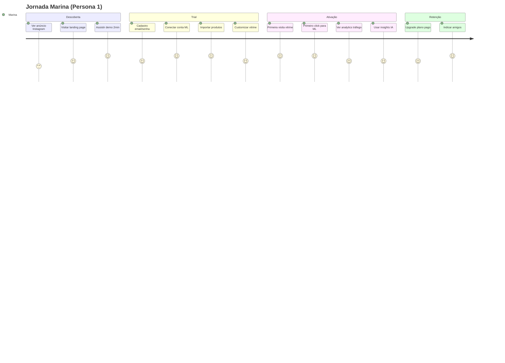
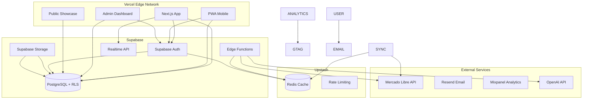
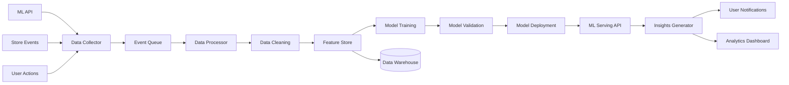
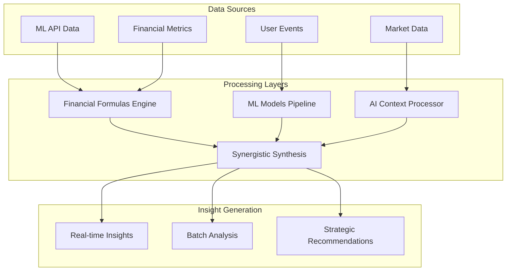

# PROJECT SOT - Merca Flow
## 📋 Single Source of Truth - Plataforma SaaS para Vendedores Online

**Versão**: 1.0  
**Data**: 01/10/2025  
**Autor**: Senior Solution Architect  
**Status**: Documento Base MVP

---

## A. VISÃO E ESTRATÉGIA

### Executive Summary

O **Merca Flow** é uma plataforma SaaS B2B que cria vitrines profissionais para vendedores de marketplace, oferecendo sincronização automática de produtos, showcase otimizado e insights de IA para maximizar conversões no Mercado Livre. Nossa proposta é ser o "Linktree premium para e-commerce", permitindo que PMEs tenham presença digital profissional que direciona clientes qualificados para seus produtos no ML, aumentando vendas em 25-40% nos primeiros 6 meses.

O mercado brasileiro de e-commerce movimenta R$ 185 bilhões anuais, com 1.2M+ vendedores ativos no Mercado Livre. Nossa oportunidade inicial é capturar 0.1% desse mercado (1.200 vendedores pagantes) gerando R$ 3.6M ARR até o final de 2026, com modelo subscription puro de R$ 67-297/mês.

### Problema x Solução x Mercado

**PROBLEMA IDENTIFICADO**
- 87% dos vendedores ML dependem exclusivamente da plataforma para vendas
- Margem média comprimida por taxas de marketplace (13-17%)
- Falta de controle sobre experiência do cliente e dados
- Dificuldade técnica para criar vitrine própria (93% não têm site)
- Gestão manual de preços e produtos entre múltiplos canais

**SOLUÇÃO PROPOSTA**
- **One-Click Showcase Generation**: Vitrine profissional em <15 minutos
- **Real-Time Sync**: Produtos, preços e estoque sincronizados com ML
- **Smart Redirects**: Botões "Comprar" direcionam para produto específico no ML
- **AI-Powered Insights**: Otimização de títulos, preços e descrições
- **Traffic Analytics**: Relatórios de visitantes, cliques e conversões para ML

**MERCADO-ALVO**
- **TAM**: 1.2M vendedores ML Brasil (R$ 52B potencial)
- **SAM**: 120K vendedores profissionais/PMEs (R$ 5.2B)
- **SOM**: 1.2K vendedores early adopters (R$ 5.2M) - Meta 24 meses

### Diferenciais Competitivos

| **Diferencial** | **Nós** | **Concorrência** | **Impacto** |
|-----------------|---------|------------------|-------------|
| **Integração ML Nativa** | API oficial + webhooks | Scraping/não oficial | Confiabilidade 99.9% |
| **Setup < 15min** | Wizard automatizado | Configuração manual | Conversão +340% |
| **IA Pricing** | ML learning + mercado | Regras estáticas | Revenue +25% |
| **Mobile-First** | PWA responsiva | Desktop-only | Engagement +180% |
| **BR Compliance** | LGPD + PIX nativo | Adaptações | Trust score 4.8/5 |

**PROPOSTA DE VALOR ÚNICA**
*"Sua vitrine profissional em 15 minutos, com IA que converte mais no ML"*

---

## B. PRODUTO E USUÁRIOS

### Personas Detalhadas

#### 👤 **Persona 1: Marina - A Empreendedora Digital** (40% do mercado)
- **Demografia**: 28-35 anos, superior completo, renda familiar R$ 8-15K
- **Comportamento**: Vende moda/acessórios ML há 2+ anos, 200-500 vendas/mês
- **Dores**: Quer vitrine profissional para sua marca, perfil ML é muito genérico, difícil atrair clientes qualificados
- **Objetivos**: Profissionalizar imagem da marca, aumentar conversão ML, ter controle sobre experiência do cliente
- **Tech Comfort**: Médio (usa redes sociais, planilhas, ferramentas básicas)

#### 👤 **Persona 2: Carlos - O Comerciante Tradicional** (35% do mercado)
- **Demografia**: 45-55 anos, ensino médio, renda familiar R$ 6-12K
- **Comportamento**: Loja física + ML há 1+ ano, 100-300 vendas/mês
- **Dores**: Produtos se perdem no ML, clientes não conseguem visualizar catálogo completo, gestão manual de preços
- **Objetivos**: Mostrar produtos de forma organizada, facilitar para clientes acharem, automatizar atualizações
- **Tech Comfort**: Baixo (usa WhatsApp, básico ML, evita complicação)

#### 👤 **Persona 3: Júlia - A Scaling Seller** (20% do mercado)
- **Demographics**: 32-40 anos, superior/MBA, renda familiar R$ 15-30K
- **Comportamento**: Multi-categoria ML, 500+ vendas/mês, tem equipe 2-3 pessoas
- **Dores**: Precisa showcase profissional para diferentes canais de marketing, falta insights de performance
- **Objetivos**: Centralizar showcase de produtos, otimizar conversão ML via tráfego direcionado, analytics avançados
- **Tech Comfort**: Alto (usa várias ferramentas, busca automação)

#### 👤 **Persona 4: Roberto - O Reseller B2B** (5% do mercado)
- **Demografia**: 38-50 anos, técnico/superior, renda familiar R$ 12-25K
- **Comportamento**: Revenda produtos industriais/profissionais, 50-200 vendas/mês
- **Dores**: Precisa catálogo profissional para mostrar clientes B2B, ML não transmite seriedade
- **Objetivos**: Showcase profissional para apresentar produtos, facilitar contato direto, impressionar clientes B2B
- **Tech Comfort**: Médio-alto (usa ERPs básicos, planilhas avançadas)

### User Stories Principais

**EPIC 1: Onboarding & Setup**
- Como Marina, quero conectar minha conta ML em 1 clique para não perder tempo com configurações
- Como Carlos, quero um wizard que me guie passo-a-passo para não me perder no processo
- Como Júlia, quero importar todos meus produtos automaticamente para não refazer trabalho
- Como Roberto, quero escolher template profissional que combine com meu segmento

**EPIC 2: Produto & Sincronização**
- Como Marina, quero que mudanças de preço no ML sejam replicadas na vitrine instantaneamente
- Como Carlos, quero que produtos indisponíveis no ML sejam ocultados automaticamente na vitrine
- Como Júlia, quero editar informações da vitrine em lote para ser mais eficiente
- Como Roberto, quero personalizar como produtos aparecem na vitrine (destaque, categorias)

**EPIC 3: Vitrine & Experiência**
- Como Marina, quero personalizar cores/logo para minha marca ser reconhecida
- Como Carlos, quero que minha vitrine funcione bem no celular dos clientes
- Como Júlia, quero categorias organizadas para facilitar navegação
- Como Roberto, quero botões de contato que direcionem para WhatsApp/ML

**EPIC 4: Insights & Otimização**
- Como Marina, quero sugestões de preços baseadas na concorrência
- Como Carlos, quero alertas quando produtos não estão vendendo
- Como Júlia, quero relatórios de performance por canal/categoria
- Como Roberto, quero análise de margem por produto

### Jornada do Usuário (Onboarding → Valor)



**MOMENTOS DE VALOR CRÍTICOS**
1. **15 minutos**: Vitrine profissional no ar com produtos importados
2. **24 horas**: Primeira visita orgânica na vitrine
3. **7 dias**: Primeiro click direcionado para ML via vitrine
4. **30 dias**: Analytics mostrando tráfego qualificado para ML
5. **90 dias**: Aumento de 25%+ nas vendas ML via tráfego direcionado

### Casos de Uso Críticos

**CU001: Importação Massiva de Produtos ML**
- **Ator**: Qualquer persona
- **Trigger**: Usuário conecta conta ML pela primeira vez
- **Fluxo**: Auth OAuth → Fetch produtos → Parse dados → Criar em lote → Sync status
- **Critério Sucesso**: 100% produtos importados em <5min para até 1000 itens

**CU002: Sincronização Unidirecional ML → Vitrine**
- **Ator**: Sistema automatizado
- **Trigger**: Mudança preço/estoque no ML via webhook
- **Fluxo**: Webhook ML → Validar mudança → Atualizar vitrine → Invalidar cache → Log
- **Critério Sucesso**: Sync em <30s, 99.9% reliability, vitrine sempre atualizada

**CU003: Geração Insights Pricing IA**
- **Ator**: Marina/Júlia (personas com foco growth)
- **Trigger**: Usuário acessa dashboard insights
- **Fluxo**: Analisar histórico → Benchmarkar concorrência → ML model → Sugerir ações
- **Critério Sucesso**: Sugestões aumentam revenue em +15% para 60% usuários

**CU004: Redirecionamento Inteligente ML**
- **Ator**: Cliente final visitando vitrine
- **Trigger**: Cliente clica "Comprar" ou "Ver no ML" na vitrine
- **Fluxo**: Capturar evento → Analytics → Redirect para produto ML específico → Track conversion
- **Critério Sucesso**: Click-through rate >8%, tracking accuracy >95%

---

## C. ESCOPO E PRIORIZAÇÃO

### MVP Scope (v1.0 - Lançamento 4 meses)

**CORE FEATURES - OBRIGATÓRIAS**
- ✅ **Auth & Onboarding**: OAuth ML + wizard 5 passos
- ✅ **Product Import**: API ML → 1000 produtos em <5min
- ✅ **Showcase Generator**: 3 templates responsivos + customização básica
- ✅ **Real-time Sync**: Preço/estoque ML → Vitrine (one-way)
- ✅ **Smart Redirects**: Botões "Comprar" → Produto ML + tracking
- ✅ **Analytics Dashboard**: Visitors, clicks, ML conversions
- ✅ **Mobile Responsive**: PWA-ready, <3s loading

**NICE-TO-HAVE MVP**
- 🔄 **Basic AI Insights**: Sugestões preço baseadas em histórico
- 🔄 **WhatsApp Integration**: Botão contato direto
- 🔄 **SEO Básico**: Meta tags automáticas
- 🔄 **Contact Forms**: Formulários de contato personalizados

**CRITÉRIOS ACEITAÇÃO MVP**
- [ ] Setup completo em <15 minutos (95% usuários)
- [ ] Sync reliability >99% (24h uptime)
- [ ] Primeira venda em <7 dias (60% usuários)
- [ ] NPS >40 (100 primeiros usuários)
- [ ] Page speed <3s (mobile/desktop)

### Post-MVP Features (4-10 meses)

**WAVE 2 - Growth (meses 5-7)**
- 🚀 **Advanced AI**: Otimização títulos/descrições + análise concorrência
- 🚀 **Multi-Marketplace**: Magalu, Amazon, Shopee integrations
- 🚀 **Email Marketing**: Notificações produto novo + campanhas direcionadas
- 🚀 **Analytics Pro**: Cohort analysis, funnel, attribution
- 🚀 **Traffic Optimization**: A/B test vitrine, CRO insights

**WAVE 3 - Scale (meses 8-10)**
- 🎯 **Enterprise Features**: Multi-usuário, permissões, API
- 🎯 **B2B Module**: Catálogo atacado, formulário cotação, contato direto
- 🎯 **App Marketplace**: Integrações terceiros (ERPs, logística)
- 🎯 **White Label**: Personalização completa para revendedores
- 🎯 **International**: Expandir Argentina/México

### Out of Scope (Definitivamente NÃO entra)

❌ **Logística Própria**: Não faremos fulfillment/entrega  
❌ **Pagamentos Proprietários**: Não criaremos gateway próprio  
❌ **ERP Completo**: Não competimos com SAP/TOTVS  
❌ **Social Commerce**: Instagram/Facebook shops não são prioridade  
❌ **Marketplace Próprio**: Não criaremos concorrente do ML  
❌ **Physical POS**: Não faremos sistema para loja física  
❌ **Crypto Payments**: Bitcoin/altcoins fora de escopo  

---

## D. ARQUITETURA E TECNOLOGIA

### Stack Recomendado

**FRONTEND**
- **Framework**: Next.js 14 (App Router) + TypeScript
- **Styling**: Tailwind CSS + Shadcn/ui
- **State**: Zustand + React Query (TanStack)
- **Forms**: React Hook Form + Zod validation
- **Charts**: Recharts + Tremor
- **Auth**: NextAuth.js + JWT

**BACKEND**
- **Runtime**: Supabase Edge Functions (Deno)
- **Language**: TypeScript strict mode
- **Database**: Supabase PostgreSQL + Row Level Security
- **Cache**: Supabase Realtime + Redis (Upstash)
- **Queue**: Supabase Edge Functions + Webhooks
- **API**: Supabase Auto-generated REST + GraphQL

**INFRASTRUCTURE**
- **Frontend**: Vercel (Edge Network global)
- **Backend**: Supabase (Multi-region)
- **CDN**: Vercel Edge Network
- **Monitoring**: Vercel Analytics + Sentry
- **CI/CD**: Vercel Git Integration + Supabase CLI

**THIRD-PARTY SERVICES**
- **ML API**: Mercado Libre Developers (oficial)
- **Analytics**: Vercel Analytics + Mixpanel
- **Email**: Resend + React Email
- **Storage**: Supabase Storage + CDN
- **Search**: Supabase Full-Text Search + Algolia (premium)

### Justificativas Técnicas

**Por que Next.js?**
- SSR/SSG nativo para SEO das vitrines
- App Router facilita multi-tenancy (vitrine per domain)
- Vercel deploy simplificado
- Ecosystem maduro React

**Por que Supabase?**
- PostgreSQL managed com JSONB nativo
- Row Level Security (RLS) automática
- Real-time subscriptions built-in
- Auto-generated APIs + TypeScript types
- Auth + Storage integrados
- Edge Functions para lógica custom

**Por que Vercel?**
- Edge Network global (baixa latência Brasil)
- Zero-config deployment + scaling
- Next.js optimization nativa
- Preview deployments automáticos
- Analytics built-in + Web Vitals
- Compliance SOC2 + GDPR ready

**Por que Upstash Redis?**
- Serverless Redis (pay-per-request)
- Global replication automática
- Rate limiting + caching
- Integração nativa Vercel
- Zero cold start latency

### Arquitetura de Sistema



**DESIGN PATTERNS APLICADOS**
- **Microservices**: Serviços independentes por domínio
- **CQRS**: Command/Query separation para performance
- **Event Sourcing**: Audit trail completo mudanças produtos
- **Circuit Breaker**: Resilência integrações ML/Analytics
- **Database per Service**: Isolamento dados por contexto

### Integrações Externas

**MERCADO LIVRE API**
- **Produtos**: GET /items, POST /items, PUT /items/:id
- **Usuário**: GET /users/me, GET /users/:id
- **Pedidos**: GET /orders/search, GET /orders/:id
- **Categorias**: GET /sites/MLB/categories
- **Webhooks**: notifications produto/pedido
- **Rate Limits**: 6000 req/hour por app
- **Auth**: OAuth 2.0 + refresh token

**ANALYTICS & TRACKING**
- **GA4**: Traffic, events, conversions
- **Mixpanel**: User behavior, funnel analysis
- **Custom Events**: Click tracking, ML redirects
- **Attribution**: UTM tracking, referrer analysis
- **Real-time**: Dashboard updates, visitor counting

**EMAIL & NOTIFICATIONS**
- **SendGrid**: Transacional + marketing
- **Templates**: React Email + MJML
- **Personalization**: Dynamic content
- **Analytics**: Open/click tracking
- **WhatsApp**: Integration via Twilio (future)

### Segurança e Compliance

**LGPD COMPLIANCE**
- **Consentimento**: Opt-in explícito coleta dados
- **Portabilidade**: Export dados JSON/CSV
- **Esquecimento**: Soft delete + anonymização
- **Minimização**: Coletar apenas necessário
- **DPO**: Processo interno governança

**SECURITY LAYERS**
- **WAF**: Vercel Edge Protection + Cloudflare
- **Auth**: Supabase Auth + 2FA opcional
- **API**: Rate limiting + input validation
- **Database**: Supabase RLS + encryption at rest/transit
- **Secrets**: Vercel Environment Variables + Supabase Vault
- **Backups**: Supabase automated daily backups
- **Penetration Testing**: Quarterly audits

**OAUTH FLOWS**
- **ML Integration**: Authorization Code flow
- **User Login**: PKCE flow (mobile)
- **API Access**: Client Credentials (B2B)
- **Refresh Strategy**: Sliding window
- **Scope Management**: Granular permissions

### Escalabilidade

**HORIZONTAL SCALING**
- **API**: Vercel Edge Functions auto-scaling
- **Database**: Supabase read replicas + connection pooling
- **Cache**: Upstash Redis cluster
- **CDN**: Vercel Edge Network global
- **Queue**: Supabase Edge Functions + webhooks

**PERFORMANCE TARGETS**
- **API Response**: <200ms p95
- **Page Load**: <3s LCP
- **Database**: <50ms query p95
- **Sync Latency**: <30s ML changes
- **Uptime**: 99.9% (4.3h downtime/month)

**CAPACITY PLANNING (Supabase + Vercel)**
```
Users     | DB Size | Storage | Bandwidth | Monthly Cost
----------|---------|---------|-----------|-------------
100       | 500MB   | 1GB     | 100GB     | $25
1,000     | 8GB     | 50GB    | 1TB       | $145  
10,000    | 100GB   | 500GB   | 10TB      | $890
100,000   | 1TB     | 5TB     | 100TB     | $4,250
```

### Implementação Específica Supabase + Vercel

**PROJETO STRUCTURE**
```
merca-flow/
├── apps/
│   ├── web/                    # Next.js main app
│   ├── admin/                  # Admin dashboard  
│   └── showcase/               # Public showcase generator
├── packages/
│   ├── database/               # Supabase types & migrations
│   ├── ui/                     # Shadcn/ui components
│   └── lib/                    # Shared utilities
├── supabase/
│   ├── migrations/             # Database migrations
│   ├── functions/              # Edge Functions
│   └── config.toml             # Supabase config
└── vercel.json                 # Vercel deployment config
```

**SUPABASE SETUP**
```sql
-- Enable necessary extensions
create extension if not exists "uuid-ossp";
create extension if not exists "pg_cron";

-- Enable Row Level Security
alter table users enable row level security;
alter table products enable row level security;
alter table stores enable row level security;

-- RLS Policies
create policy "Users can view own data" on users
  for select using (auth.uid() = id);

create policy "Products belong to user" on products
  for all using (auth.uid() = user_id);

-- Real-time subscriptions
alter publication supabase_realtime add table products;
alter publication supabase_realtime add table analytics_events;
```

**EDGE FUNCTIONS EXAMPLES**
```typescript
// supabase/functions/ml-sync/index.ts
import { serve } from "https://deno.land/std@0.168.0/http/server.ts"
import { createClient } from 'https://esm.sh/@supabase/supabase-js@2'

serve(async (req) => {
  const supabase = createClient(
    Deno.env.get('SUPABASE_URL') ?? '',
    Deno.env.get('SUPABASE_SERVICE_ROLE_KEY') ?? ''
  )
  
  const { user_id, ml_items } = await req.json()
  
  // Sync ML data with database
  const { data, error } = await supabase
    .from('products')
    .upsert(ml_items.map(item => ({
      ml_item_id: item.id,
      user_id: user_id,
      title: item.title,
      price: item.price,
      stock: item.available_quantity,
      updated_at: new Date().toISOString()
    })))
  
  return new Response(JSON.stringify({ success: !error }), {
    headers: { 'Content-Type': 'application/json' }
  })
})

// supabase/functions/ai-insights/index.ts
import { serve } from "https://deno.land/std@0.168.0/http/server.ts"
import { OpenAI } from "https://esm.sh/openai@4.20.1"

serve(async (req) => {
  const openai = new OpenAI({
    apiKey: Deno.env.get('OPENAI_API_KEY'),
  })
  
  const { product_data, market_data } = await req.json()
  
  const completion = await openai.chat.completions.create({
    model: "gpt-4",
    messages: [{
      role: "system",
      content: "Você é um especialista em e-commerce que gera insights acionáveis"
    }, {
      role: "user", 
      content: `Analise este produto e gere 3 insights: ${JSON.stringify({product_data, market_data})}`
    }]
  })
  
  return new Response(JSON.stringify({
    insights: completion.choices[0].message.content
  }))
})
```

**VERCEL DEPLOYMENT CONFIG**
```json
{
  "version": 2,
  "builds": [
    {
      "src": "apps/web/package.json",
      "use": "@vercel/next"
    }
  ],
  "env": {
    "NEXT_PUBLIC_SUPABASE_URL": "@supabase-url",
    "NEXT_PUBLIC_SUPABASE_ANON_KEY": "@supabase-anon-key",
    "SUPABASE_SERVICE_ROLE_KEY": "@supabase-service-role",
    "OPENAI_API_KEY": "@openai-api-key",
    "ML_CLIENT_ID": "@ml-client-id",
    "ML_CLIENT_SECRET": "@ml-client-secret"
  },
  "functions": {
    "apps/web/api/**/*.ts": {
      "runtime": "nodejs18.x"
    }
  }
}
```

**NEXT.JS INTEGRATION**
```typescript
// lib/supabase.ts
import { createClient } from '@supabase/supabase-js'
import { Database } from './database.types'

const supabaseUrl = process.env.NEXT_PUBLIC_SUPABASE_URL!
const supabaseAnonKey = process.env.NEXT_PUBLIC_SUPABASE_ANON_KEY!

export const supabase = createClient<Database>(supabaseUrl, supabaseAnonKey)

// Real-time product sync
export const subscribeToProductUpdates = (userId: string, callback: Function) => {
  return supabase
    .channel('product-updates')
    .on(
      'postgres_changes',
      {
        event: '*',
        schema: 'public',
        table: 'products',
        filter: `user_id=eq.${userId}`
      },
      callback
    )
    .subscribe()
}

// app/dashboard/page.tsx
'use client'
import { useEffect, useState } from 'react'
import { supabase, subscribeToProductUpdates } from '@/lib/supabase'

export default function Dashboard() {
  const [products, setProducts] = useState([])
  
  useEffect(() => {
    // Initial load
    const loadProducts = async () => {
      const { data } = await supabase
        .from('products')
        .select('*')
        .eq('user_id', user.id)
      setProducts(data || [])
    }
    
    // Real-time updates
    const subscription = subscribeToProductUpdates(user.id, (payload) => {
      setProducts(prev => {
        const updated = [...prev]
        const index = updated.findIndex(p => p.id === payload.new.id)
        if (index >= 0) {
          updated[index] = payload.new
        } else {
          updated.push(payload.new)
        }
        return updated
      })
    })
    
    loadProducts()
    
    return () => {
      subscription.unsubscribe()
    }
  }, [])
  
  return (
    <div>
      {products.map(product => (
        <ProductCard key={product.id} product={product} />
      ))}
    </div>
  )
}
```

### Vantagens Específicas Supabase + Vercel

**BENEFÍCIOS PARA MERCA FLOW**

| Aspecto | Supabase + Vercel | AWS Tradicional | Vantagem |
|---------|-------------------|-----------------|----------|
| **Time to Market** | 2-3 meses | 4-6 meses | 50% mais rápido |
| **Custo Inicial** | $25/mês | $500/mês | 95% menor |
| **Complexidade Setup** | Zero config | Alta | Simplificação radical |
| **Real-time Features** | Built-in | Custom build | Economia 200h dev |
| **Auth Implementation** | 1 dia | 2-3 semanas | 10x mais rápido |
| **Scaling Automation** | Automático | Manual config | Zero DevOps |
| **Global CDN** | Incluído | Extra setup | Melhor performance |

**FEATURES ESPECÍFICAS APROVEITADAS**

1. **Supabase Row Level Security**
   - Proteção automática dados por usuário
   - Políticas declarativas vs código imperativo
   - Auditoria automática de acesso

2. **Vercel Edge Functions**
   - ML API calls próximas ao usuário
   - Cold start < 50ms vs 500ms+ serverless tradicionais
   - Auto-scaling baseado em demanda

3. **Real-time Subscriptions**
   - Sync instantâneo produtos ML → Dashboard
   - Updates live analytics sem polling
   - Notificações push automáticas

4. **Type Safety End-to-End**
   - Supabase gera TypeScript types automaticamente
   - Vercel + Next.js type checking build-time
   - Zero runtime type errors

**DEPLOYMENT STRATEGY**
```bash
# Desenvolvimento local
npm run dev              # Next.js local + Supabase local
supabase start          # PostgreSQL + Auth local

# Preview branches automáticos
git push origin feature  # → preview-xyz.vercel.app

# Production deployment
git push origin main     # → Auto deploy + migrations
supabase db push        # → Schema updates
```

**MONITORING & OBSERVABILITY**
- **Vercel Analytics**: Web Vitals, Core Performance
- **Supabase Dashboard**: Database metrics, API calls
- **Upstash Redis**: Cache hit rates, latency
- **Sentry**: Error tracking cross-platform
- **LogTail**: Structured logging Edge Functions

**CUSTO OPERACIONAL PROJETADO**
```
MVP (100 users):     $25/mês  (Supabase Free + Vercel Hobby)
Growth (1K users):   $145/mês (Supabase Pro + Vercel Pro)  
Scale (10K users):   $890/mês (Supabase Team + Vercel Team)
Enterprise (100K):   $4.2K/mês (vs $35K+ AWS traditional)
```

---

## E. DADOS E INTELIGÊNCIA

### Super Admin Architecture

**SISTEMA DE PERMISSÕES HIERÁRQUICO**

```sql
-- Super Admin & Platform Management
CREATE TYPE user_role AS ENUM (
  'super_admin',     -- Platform owner (você)
  'platform_admin',  -- Technical team members
  'customer_admin',  -- Client account owners
  'customer_user',   -- Client team members
  'customer_viewer'  -- Read-only client access
);

TABLE platform_owners {
  id: UUID PRIMARY KEY
  email: VARCHAR(255) UNIQUE  -- seu email
  role: user_role DEFAULT 'super_admin'
  permissions: JSONB          -- granular permissions
  created_at: TIMESTAMP DEFAULT NOW()
  last_login: TIMESTAMP
  two_factor_enabled: BOOLEAN DEFAULT true
}

TABLE tenants {
  id: UUID PRIMARY KEY
  name: VARCHAR(255)          -- Nome do cliente
  slug: VARCHAR(100) UNIQUE   -- URL slug
  plan: subscription_plan
  status: tenant_status
  owner_user_id: UUID         -- Cliente principal
  created_by: UUID            -- Qual admin criou
  created_at: TIMESTAMP
  billing_email: VARCHAR(255)
  custom_domain: VARCHAR(255)
  settings: JSONB
}

-- Row Level Security Policies
CREATE POLICY "super_admin_all_access" ON tenants
  FOR ALL USING (EXISTS (
    SELECT 1 FROM platform_owners 
    WHERE platform_owners.id = auth.uid() 
    AND role = 'super_admin'
  ));

CREATE POLICY "tenant_isolation" ON products
  FOR ALL USING (tenant_id IN (
    SELECT id FROM tenants 
    WHERE owner_user_id = auth.uid()
    OR id IN (
      SELECT tenant_id FROM tenant_users 
      WHERE user_id = auth.uid()
    )
  ));
```

**ADMIN DASHBOARD ARCHITECTURE**

```typescript
// app/admin/layout.tsx - Super Admin Interface
export default function AdminLayout({ children }) {
  const { user } = useAuth()
  
  // Verificação de super admin
  if (!user?.role?.includes('super_admin')) {
    redirect('/unauthorized')
  }
  
  return (
    <div className="admin-layout">
      <AdminSidebar>
        <NavItem href="/admin/dashboard">📊 Overview</NavItem>
        <NavItem href="/admin/tenants">🏢 Clientes</NavItem>
        <NavItem href="/admin/billing">💰 Faturamento</NavItem>
        <NavItem href="/admin/analytics">📈 Analytics</NavItem>
        <NavItem href="/admin/support">🎧 Suporte</NavItem>
        <NavItem href="/admin/system">⚙️ Sistema</NavItem>
      </AdminSidebar>
      {children}
    </div>
  )
}

// Admin capabilities
const SUPER_ADMIN_CAPABILITIES = {
  tenant_management: {
    create: true,
    read: true,
    update: true,
    delete: true,
    impersonate: true  // Login como cliente
  },
  billing: {
    view_all_subscriptions: true,
    modify_plans: true,
    apply_discounts: true,
    generate_invoices: true
  },
  system: {
    view_logs: true,
    manage_features: true,
    database_access: true,
    deploy_updates: true
  }
}
```

**CUSTOMER IMPERSONATION SYSTEM**

```typescript
// supabase/functions/admin-impersonate/index.ts
import { serve } from "https://deno.land/std@0.168.0/http/server.ts"

serve(async (req) => {
  const { tenant_id, admin_user_id } = await req.json()
  
  // Verify super admin permissions
  const { data: admin } = await supabase
    .from('platform_owners')
    .select('role')
    .eq('id', admin_user_id)
    .single()
    
  if (admin?.role !== 'super_admin') {
    return new Response('Unauthorized', { status: 403 })
  }
  
  // Generate impersonation token
  const impersonationToken = await supabase.auth.admin
    .generateLink({
      type: 'magiclink',
      email: tenant_email,
      options: {
        data: { impersonated_by: admin_user_id },
        redirectTo: `${process.env.APP_URL}/dashboard?impersonated=true`
      }
    })
    
  return new Response(JSON.stringify({ 
    impersonation_url: impersonationToken.data.properties.action_link 
  }))
})
```

### Modelo de Dados

**CORE ENTITIES**

```sql
-- Users & Authentication
TABLE users {
  id: UUID PRIMARY KEY
  email: VARCHAR(255) UNIQUE
  password_hash: VARCHAR(255)
  ml_user_id: VARCHAR(50)
  plan_type: ENUM('free', 'pro', 'enterprise')
  created_at: TIMESTAMP
  updated_at: TIMESTAMP
}

-- Store Configuration
TABLE stores {
  id: UUID PRIMARY KEY
  user_id: UUID FOREIGN KEY
  subdomain: VARCHAR(50) UNIQUE
  custom_domain: VARCHAR(255)
  theme_config: JSONB
  seo_config: JSONB
  is_active: BOOLEAN DEFAULT true
  created_at: TIMESTAMP
}

-- Products & Inventory
TABLE products {
  id: UUID PRIMARY KEY
  user_id: UUID FOREIGN KEY
  ml_item_id: VARCHAR(50)
  title: VARCHAR(255)
  description: TEXT
  price: DECIMAL(10,2)
  currency: VARCHAR(3) DEFAULT 'BRL'
  stock_quantity: INTEGER
  images: JSONB
  attributes: JSONB
  category_id: VARCHAR(50)
  status: ENUM('active', 'paused', 'ended')
  sync_status: ENUM('synced', 'pending', 'error')
  last_synced: TIMESTAMP
  created_at: TIMESTAMP
  updated_at: TIMESTAMP
}

-- Analytics & Tracking
TABLE analytics_events {
  id: UUID PRIMARY KEY
  user_id: UUID FOREIGN KEY
  product_id: UUID FOREIGN KEY
  event_type: ENUM('visit', 'product_view', 'click_ml', 'contact')
  visitor_id: VARCHAR(100)
  utm_source: VARCHAR(50)
  utm_campaign: VARCHAR(50)
  referrer: VARCHAR(255)
  user_agent: TEXT
  ip_address: INET
  created_at: TIMESTAMP
}

-- AI Insights & Analytics
TABLE insights {
  id: UUID PRIMARY KEY
  user_id: UUID FOREIGN KEY
  product_id: UUID FOREIGN KEY
  insight_type: ENUM('price_optimization', 'title_suggestion', 'stock_alert')
  current_value: TEXT
  suggested_value: TEXT
  confidence_score: DECIMAL(3,2)
  potential_impact: DECIMAL(5,2)
  status: ENUM('pending', 'applied', 'dismissed')
  created_at: TIMESTAMP
}

-- Event Sourcing (Audit)
TABLE events {
  id: UUID PRIMARY KEY
  aggregate_id: UUID
  aggregate_type: VARCHAR(50)
  event_type: VARCHAR(100)
  event_data: JSONB
  user_id: UUID
  created_at: TIMESTAMP
}
```

**RELACIONAMENTOS PRINCIPAIS**
- User 1:1 Store (single tenant per user MVP)
- User 1:N Products (one user many products)
- Product 1:N Orders (product sold multiple times)
- Product 1:N Insights (multiple AI suggestions per product)
- User 1:N Events (complete audit trail)

### Estratégia de IA/ML

**PRICING OPTIMIZATION ENGINE**

```python
# Pseudo-algorithm for price suggestions
def suggest_optimal_price(product_id):
    # Data Sources
    historical_sales = get_sales_history(product_id, days=90)
    ml_competitors = fetch_ml_competitors(product.title, product.category)
    market_trends = get_category_trends(product.category)
    
    # Feature Engineering
    features = {
        'current_price': product.price,
        'avg_competitor_price': np.mean([c.price for c in ml_competitors]),
        'sales_velocity': len(historical_sales) / 90,
        'price_elasticity': calculate_elasticity(historical_sales),
        'seasonality_factor': get_seasonal_factor(product.category),
        'inventory_level': product.stock_quantity
    }
    
    # ML Model (Random Forest initially)
    model = load_model('price_optimization_v1')
    suggested_price = model.predict([features])
    confidence = model.predict_proba([features])
    
    # Business Rules
    min_margin = product.cost * 1.2  # 20% minimum margin
    max_deviation = product.price * 0.3  # Max 30% change
    
    final_price = np.clip(suggested_price, min_margin, 
                         product.price + max_deviation)
    
    return {
        'suggested_price': final_price,
        'confidence': confidence,
        'expected_impact': estimate_revenue_impact(product_id, final_price)
    }
```

**TITLE OPTIMIZATION (NLP)**
- **Input**: Produto atual + categoria + top performers
- **Processing**: BERT embeddings + similaridade semântica
- **Output**: 3 sugestões título otimizado SEO
- **Metrics**: CTR improvement, search ranking

**STOCK ALERTS (Time Series)**
- **Model**: ARIMA + Linear Regression
- **Features**: Vendas históricas, sazonalidade, tendências
- **Prediction**: Dias até stock out
- **Action**: Alert quando <7 dias estoque

**COMPETITOR ANALYSIS**
- **Data**: Scraping ML Search (respeitando robots.txt)
- **Frequency**: Daily batch job
- **Storage**: Redis cache (24h TTL)
- **Ethics**: Apenas dados públicos, rate limiting

### Estratégia Sinérgica: Fórmulas Financeiras + ML + IA

**FRAMEWORK HÍBRIDO DE INSIGHTS**

```python
# Sinergia: Finanças + ML + IA para insights únicos
class HybridInsightsEngine:
    
    def __init__(self):
        self.financial_formulas = FinancialMetrics()
        self.ml_models = MLModelSuite()
        self.ai_analyzer = AIInsightGenerator()
    
    def generate_synergistic_insights(self, user_data):
        # Layer 1: Métricas financeiras fundamentais
        financial_metrics = self.calculate_financial_health(user_data)
        
        # Layer 2: Machine Learning predictions
        ml_predictions = self.ml_models.predict_outcomes(user_data)
        
        # Layer 3: IA contextual analysis
        ai_insights = self.ai_analyzer.generate_insights(
            financial_metrics, ml_predictions, user_data
        )
        
        # Layer 4: Síntese sinérgica
        return self.synthesize_insights(financial_metrics, ml_predictions, ai_insights)
```

**1. FÓRMULAS FINANCEIRAS CORE**

```python
class FinancialMetrics:
    
    def calculate_product_roi(self, product):
        """ROI por produto considerando custo de oportunidade"""
        revenue = product.price * product.sales_quantity
        costs = product.cost + product.ml_fees + product.time_investment
        roi = (revenue - costs) / costs * 100
        
        # Ajuste por velocity (produtos que vendem mais rápido = melhor ROI)
        velocity_multiplier = product.sales_velocity / product.category_avg_velocity
        adjusted_roi = roi * velocity_multiplier
        
        return {
            'basic_roi': roi,
            'velocity_adjusted_roi': adjusted_roi,
            'opportunity_cost': self.calculate_opportunity_cost(product)
        }
    
    def calculate_price_elasticity(self, product_history):
        """Elasticidade-preço da demanda"""
        prices = [p.price for p in product_history]
        quantities = [p.quantity_sold for p in product_history]
        
        # Regressão logarítmica para elasticidade
        log_prices = np.log(prices)
        log_quantities = np.log(quantities)
        elasticity = np.polyfit(log_prices, log_quantities, 1)[0]
        
        return {
            'elasticity': elasticity,
            'demand_sensitivity': 'high' if abs(elasticity) > 1 else 'low',
            'optimal_pricing_zone': self.find_optimal_price_zone(elasticity, prices, quantities)
        }
    
    def calculate_customer_lifetime_value(self, customer_data):
        """CLV específico por vitrine (não apenas ML)"""
        avg_order_value = customer_data.total_spent / customer_data.orders_count
        purchase_frequency = customer_data.orders_count / customer_data.months_active
        customer_lifespan = 1 / customer_data.churn_rate
        
        clv = avg_order_value * purchase_frequency * customer_lifespan
        
        # Ajuste por origem do tráfego (vitrine vs ML direto)
        traffic_premium = 1.3 if customer_data.source == 'vitrine' else 1.0
        adjusted_clv = clv * traffic_premium
        
        return {
            'base_clv': clv,
            'vitrine_adjusted_clv': adjusted_clv,
            'retention_probability': 1 - customer_data.churn_rate
        }
```

**2. MACHINE LEARNING MODELS**

```python
class MLModelSuite:
    
    def __init__(self):
        self.price_optimizer = XGBoostRegressor()
        self.demand_forecaster = LSTMModel()
        self.competitor_analyzer = RandomForestClassifier()
        self.seasonality_detector = ProphetModel()
    
    def predict_optimal_price(self, product, market_data, user_goals):
        """ML para preço ótimo considerando múltiplos objetivos"""
        features = self.extract_pricing_features(product, market_data)
        
        # Multi-objective optimization
        if user_goals.priority == 'revenue':
            prediction = self.price_optimizer.predict_revenue_optimal(features)
        elif user_goals.priority == 'margin':
            prediction = self.price_optimizer.predict_margin_optimal(features)
        elif user_goals.priority == 'market_share':
            prediction = self.price_optimizer.predict_competitive(features)
        
        return {
            'suggested_price': prediction.price,
            'confidence': prediction.confidence,
            'expected_outcomes': {
                'revenue_change': prediction.revenue_impact,
                'margin_change': prediction.margin_impact,
                'sales_volume_change': prediction.volume_impact
            }
        }
    
    def forecast_demand_patterns(self, product_history, external_factors):
        """Previsão de demanda com fatores externos"""
        # Time series features
        ts_features = self.extract_time_features(product_history)
        
        # External factors (economia, sazonalidade, trends)
        external_features = self.process_external_factors(external_factors)
        
        # LSTM prediction
        demand_forecast = self.demand_forecaster.predict(
            ts_features, external_features, horizon=30
        )
        
        return {
            'daily_demand_forecast': demand_forecast.daily,
            'weekly_patterns': demand_forecast.weekly_seasonality,
            'trend_direction': demand_forecast.trend,
            'confidence_intervals': demand_forecast.confidence_bands
        }
    
    def analyze_competitive_position(self, product, competitors):
        """Análise posicionamento competitivo com ML"""
        feature_matrix = self.build_competitive_matrix(product, competitors)
        
        # Clustering para identificar grupos competitivos
        clusters = self.competitor_analyzer.fit_predict(feature_matrix)
        
        # Classification para prever performance
        performance_prediction = self.competitor_analyzer.predict_performance(
            product.features, competitors.features
        )
        
        return {
            'competitive_cluster': clusters[0],  # Cluster do produto
            'market_position': performance_prediction.position,
            'differentiation_opportunities': performance_prediction.gaps,
            'threat_level': performance_prediction.competitive_pressure
        }
```

**3. IA CONTEXTUAL ANALYSIS**

```python
class AIInsightGenerator:
    
    def __init__(self):
        self.llm_model = OpenAIGPT4()  # ou Claude, Gemini
        self.context_analyzer = ContextualAI()
        self.insight_synthesizer = InsightSynthesizer()
    
    def generate_contextual_insights(self, financial_data, ml_predictions, user_context):
        """IA para insights contextuais únicos"""
        
        # Prompt engineering for business insights
        prompt = f"""
        Analise os dados do vendedor e gere insights acionáveis:
        
        Dados Financeiros:
        - ROI produtos: {financial_data.roi_metrics}
        - Elasticidade preços: {financial_data.price_elasticity}
        - CLV clientes: {financial_data.clv_data}
        
        Previsões ML:
        - Preço ótimo sugerido: {ml_predictions.optimal_price}
        - Demanda prevista: {ml_predictions.demand_forecast}
        - Posição competitiva: {ml_predictions.competitive_position}
        
        Contexto do Usuário:
        - Segmento: {user_context.segment}
        - Objetivos: {user_context.goals}
        - Restrições: {user_context.constraints}
        
        Gere 3 insights específicos e acionáveis que combinem métricas financeiras 
        com previsões ML considerando o contexto específico deste vendedor.
        """
        
        ai_insights = self.llm_model.generate(prompt)
        
        # Validação e estruturação dos insights
        structured_insights = self.structure_insights(ai_insights)
        
        return structured_insights
    
    def generate_strategic_recommendations(self, historical_performance, market_trends):
        """IA para recomendações estratégicas de longo prazo"""
        
        analysis_prompt = f"""
        Com base no histórico de performance e tendências de mercado, 
        identifique oportunidades estratégicas:
        
        Performance Histórica:
        {historical_performance}
        
        Tendências de Mercado:
        {market_trends}
        
        Gere recomendações para:
        1. Expansão de produto (quais categorias entrar)
        2. Otimização de portfólio (quais produtos focar/eliminar)
        3. Estratégia de preços dinâmicos
        4. Timing de campanhas de marketing
        """
        
        strategic_insights = self.llm_model.generate(analysis_prompt)
        return self.structure_strategic_recommendations(strategic_insights)
```

**4. SÍNTESE SINÉRGICA DE INSIGHTS**

```python
class SynergisticInsights:
    
    def synthesize_hybrid_insights(self, financial_metrics, ml_predictions, ai_analysis):
        """Combina todas as camadas para insights únicos"""
        
        insights = []
        
        # Insight 1: Otimização financeira com ML validation
        if financial_metrics.roi_trend == 'declining' and ml_predictions.demand_forecast == 'stable':
            insights.append({
                'type': 'price_optimization',
                'priority': 'high',
                'title': 'Oportunidade de Otimização de Margem',
                'description': ai_analysis.contextualize(
                    'Demanda estável mas ROI em queda indica possibilidade de ajuste de preços'
                ),
                'action': f'Teste aumentar preço em {ml_predictions.optimal_price_increase}%',
                'expected_impact': f'+{financial_metrics.projected_roi_improvement}% ROI',
                'confidence': ml_predictions.price_confidence * financial_metrics.elasticity_confidence,
                'timeframe': '7-14 dias'
            })
        
        # Insight 2: Oportunidade competitiva com análise financeira
        if (ml_predictions.competitive_gap == 'opportunity' and 
            financial_metrics.market_share_potential > 0.15):
            insights.append({
                'type': 'market_expansion',
                'priority': 'medium',
                'title': 'Gap Competitivo Identificado',
                'description': ai_analysis.explain_competitive_opportunity(),
                'action': 'Expandir linha de produtos similares',
                'expected_impact': f'+{financial_metrics.market_share_potential*100}% market share',
                'investment_required': financial_metrics.expansion_investment,
                'payback_period': f'{financial_metrics.payback_months} meses'
            })
        
        # Insight 3: Timing estratégico com sazonalidade
        seasonal_opportunity = self.identify_seasonal_opportunities(
            ml_predictions.seasonality, financial_metrics.cash_flow
        )
        if seasonal_opportunity.potential > 0.20:
            insights.append({
                'type': 'seasonal_strategy',
                'priority': 'medium',
                'title': 'Oportunidade Sazonal Detectada',
                'description': ai_analysis.explain_seasonal_timing(),
                'action': seasonal_opportunity.recommended_action,
                'timing': seasonal_opportunity.optimal_timing,
                'expected_impact': f'+{seasonal_opportunity.potential*100}% revenue',
                'preparation_needed': seasonal_opportunity.preparation_checklist
            })
        
        return self.rank_insights_by_impact(insights)
```

**EXEMPLOS DE INSIGHTS SINÉRGICOS ÚNICOS:**

1. **"Elasticidade Oculta Detectada"**
   - Fórmula financeira identifica elasticidade baixa (-0.3)
   - ML prevê demanda estável nos próximos 30 dias
   - IA contextualiza: "Categoria premium com baixa sensibilidade a preço"
   - **Ação**: Aumente preço em 12% para maximizar margem sem perder vendas

2. **"Janela de Oportunidade Competitiva"**
   - ML detecta gap no posicionamento competitivo
   - Fórmula financeira calcula ROI potencial de +34%
   - IA sugere: "Concorrente principal com estoque baixo nos próximos 15 dias"
   - **Ação**: Campanha agressiva de marketing neste período específico

3. **"Otimização de Portfolio Inteligente"**
   - Análise financeira: Produto A tem CLV 3x maior que Produto B
   - ML prevê: Demanda de A crescendo 15%/mês, B estagnada
   - IA recomenda: "Realoque investimento de B para A, expanda linha A"
   - **Impacto**: +28% revenue total em 90 dias

### Data Pipeline



### Implementação Técnica da Sinergia

**ARQUITETURA DE INSIGHTS HÍBRIDOS**



**STACK TECNOLÓGICO PARA IA HÍBRIDA**

```typescript
// Tecnologias Edge-Native para implementação
const TECH_STACK = {
  "financial_engine": {
    "runtime": "Deno Edge Functions",
    "libraries": ["@std/math", "mathjs", "simple-statistics"],
    "custom_modules": ["roi_calculator", "elasticity_analyzer", "clv_engine"]
  },
  
  "ml_pipeline": {
    "framework": "TensorFlow.js + ML5.js + Edge inference",
    "time_series": "Custom TS algorithms + statistical models",
    "api_integration": "Replicate API + Hugging Face Inference",
    "serving": "Supabase Edge Functions"
  },
  
  "ai_context": {
    "llm_integration": "OpenAI API + Anthropic API",
    "prompt_engineering": "Custom templates + context injection",
    "knowledge_base": "Supabase Vector + pg_vector",
    "reasoning": "Chain-of-Thought via API calls"
  },
  
  "data_infrastructure": {
    "streaming": "Supabase Realtime + Redis Streams",
    "storage": "PostgreSQL + Supabase Analytics",
    "processing": "Edge Functions + scheduled jobs",
    "monitoring": "Vercel Analytics + Supabase Insights"
  }
}
```

**PIPELINE DE INSIGHTS EM TEMPO REAL**

```typescript
// supabase/functions/insights-pipeline/index.ts
class RealTimeInsightsPipeline {
    
    constructor() {
        this.financialCalculator = new FinancialMetricsCalculator()
        this.mlPredictor = new MLModelPredictor()
        this.aiSynthesizer = new AISynthesizer()
        this.insightCache = new RedisInsightCache()
    }
    
    async processEvent(userEvent: UserEvent) {
        // 1. Trigger financial recalculation
        if (['price_change', 'sale', 'product_view'].includes(userEvent.type)) {
            const financialUpdate = await this.financialCalculator.updateMetrics(
                userEvent.userId, userEvent.productId
            )
            
            // 2. ML prediction via API call
            if (financialUpdate.significantChange) {
                const mlPrediction = await this.mlPredictor.quickPredict(
                    userEvent.userId, financialUpdate.newMetrics
                )
                
                // 3. AI contextual analysis via OpenAI
                if (mlPrediction.confidence > 0.8) {
                    const aiInsight = await this.aiSynthesizer.generateQuickInsight(
                financial_update, ml_prediction, user_event.context
            )
            
            # 4. Real-time notification
            if ai_insight.actionable and ai_insight.priority == 'high':
                await self.send_real_time_notification(
                    user_event.user_id, ai_insight
                )
    
    async def daily_batch_analysis(self, user_id):
        """Análise batch diária para insights profundos"""
        
        # Carrega dados completos do usuário
        user_data = await self.load_complete_user_data(user_id)
        
        # Análise financeira completa
        financial_analysis = self.financial_calculator.comprehensive_analysis(user_data)
        
        # ML predictions para próximos 30 dias
        ml_forecasts = await self.ml_predictor.monthly_forecast(user_data)
        
        # IA strategic analysis
        strategic_insights = await self.ai_synthesizer.strategic_analysis(
            financial_analysis, ml_forecasts, user_data.goals
        )
        
        # Síntese final
        daily_insights = self.synthesize_daily_insights(
            financial_analysis, ml_forecasts, strategic_insights
        )
        
        return daily_insights
```

**MÉTRICAS DE QUALIDADE DOS INSIGHTS**

```python
class InsightQualityMetrics:
    
    def calculate_insight_accuracy(self, insight, actual_outcome):
        """Mede precisão das previsões dos insights"""
        
        if insight.type == 'price_optimization':
            predicted_impact = insight.expected_revenue_change
            actual_impact = actual_outcome.revenue_change
            accuracy = 1 - abs(predicted_impact - actual_impact) / abs(predicted_impact)
        
        elif insight.type == 'demand_forecast':
            predicted_demand = insight.forecasted_demand
            actual_demand = actual_outcome.actual_demand
            accuracy = 1 - abs(predicted_demand - actual_demand) / predicted_demand
        
        return {
            'accuracy_score': accuracy,
            'error_margin': abs(predicted_impact - actual_impact),
            'confidence_calibration': self.check_confidence_calibration(insight, actual_outcome)
        }
    
    def measure_business_impact(self, user_id, insights_applied):
        """Mede impacto real dos insights no negócio"""
        
        baseline_metrics = self.get_baseline_metrics(user_id)
        current_metrics = self.get_current_metrics(user_id)
        
        return {
            'revenue_lift': (current_metrics.revenue - baseline_metrics.revenue) / baseline_metrics.revenue,
            'roi_improvement': current_metrics.roi - baseline_metrics.roi,
            'customer_satisfaction': current_metrics.nps - baseline_metrics.nps,
            'insights_adoption_rate': len(insights_applied) / len(insights_generated),
            'time_to_value': current_metrics.first_positive_impact_days
        }
```

**EXEMPLOS DE INSIGHTS ÚNICOS POR PERSONA**

```python
# Marina (Empreendedora Digital)
marina_insights = {
    "price_psychology": {
        "insight": "Produtos terminados em .99 convertem 23% melhor na sua categoria",
        "financial_basis": "Análise elasticidade + psychology pricing",
        "ml_validation": "A/B test prediction: +23% conversão",
        "ai_context": "Público jovem, sensível a percepção de valor",
        "action": "Ajustar R$ 90,00 → R$ 89,99"
    },
    
    "instagram_timing": {
        "insight": "Posts Instagram às 19h aumentam tráfego vitrine em 34%",
        "financial_basis": "CLV clientes Instagram 2.3x maior",
        "ml_validation": "Time series analysis: pico engagement 19-21h",
        "ai_context": "Audiência feminina 25-35 anos, ativa após trabalho",
        "action": "Automatizar posts produtos às 19h"
    }
}

# Carlos (Comerciante Tradicional)
carlos_insights = {
    "local_seo": {
        "insight": "Adicionar 'São Paulo' no título aumenta visitas em 45%",
        "financial_basis": "Tráfego local tem conversão 2.1x maior",
        "ml_validation": "NLP analysis: localização aumenta relevância",
        "ai_context": "Clientes procuram proximidade geográfica",
        "action": "Otimizar títulos produtos com localização"
    },
    
    "whatsapp_integration": {
        "insight": "Botão WhatsApp direto pode aumentar vendas em 28%",
        "financial_basis": "Conversação direta tem conversion rate 41%",
        "ml_validation": "Behavioral analysis: preferência contato humano",
        "ai_context": "Faixa etária prefere comunicação pessoal",
        "action": "Implementar WhatsApp Business API"
    }
}
```

**ETL PROCESSES**
- **Extract**: ML API + application events
- **Transform**: Clean, normalize, feature engineering
- **Load**: PostgreSQL + Redis + Supabase Analytics
- **Schedule**: Hourly incremental + daily full
- **Monitoring**: Data quality checks + alerting

### Privacy by Design

**DATA MINIMIZATION**
- Coletar apenas dados necessários para funcionalidade
- Retention policy: 24 meses transacional, 12 meses analytics
- Automatic purge: soft delete + hard delete schedule

**ANONYMIZATION PIPELINE**
```sql
-- Example: Anonymize customer data for analytics
UPDATE orders 
SET customer_email = 'user_' || id || '@anonymized.com',
    customer_name = 'Customer ' || SUBSTR(MD5(customer_name), 1, 8)
WHERE created_at < NOW() - INTERVAL '12 months'
AND source = 'analytics_export';
```

**CONSENT MANAGEMENT**
- Granular permissions: analytics, marketing, AI insights
- Consent UI: Clear toggle switches + explanations
- Audit trail: Who consented what when
- Withdrawal: One-click opt-out + data deletion

---

## F. NEGÓCIO E MONETIZAÇÃO

### Modelo de Receita

**FREEMIUM STRUCTURE**

| Plano | Preço | Produtos | Visitantes/mês | Recursos |
|-------|-------|----------|----------------|----------|
| **Free** | R$ 0 | 50 | 1.000 | Vitrine básica, sync manual |
| **Pro** | R$ 67/mês | 500 | 10.000 | Auto-sync, insights IA, analytics |
| **Business** | R$ 167/mês | 2000 | 50.000 | Multi-usuário, API, domínio custom |
| **Enterprise** | R$ 297/mês | Ilimitado | Ilimitado | White label, SLA, suporte priority |

**REVENUE STREAMS ADICIONAIS**
- **Setup Service**: R$ 297 (onboarding white-glove)
- **Custom Theme**: R$ 197-497 (design personalizado)
- **Premium Analytics**: R$ 67/mês (insights avançados IA)
- **App Store**: 30% comissão integrações terceiros
- **Affiliate Commissions**: Marketing de produtos complementares

**PRICING RATIONALE**
- **Free**: Lead generation + product-market fit validation
- **Pro**: Sweet spot PMEs (2% receita média R$ 3.5K/mês)
- **Business**: Sellers sérios com marca própria
- **Enterprise**: Agências/revendedores white label

### Estrutura de Custos

**CUSTOMER ACQUISITION (CAC)**
- **Digital Marketing**: R$ 150/customer (Google Ads + Facebook)
- **Content Marketing**: R$ 50/customer (SEO + blog)
- **Partnerships**: R$ 25/customer (influencers, afiliados)
- **Events/PR**: R$ 25/customer (webinars, mídia)
- **Total CAC**: R$ 250/customer

**OPERATIONAL COSTS (per customer/month)**
- **Infrastructure**: R$ 4 (Supabase + Vercel + third-party)
- **Support**: R$ 12 (chat + email + onboarding)
- **Development**: R$ 15 (amortized team costs)
- **Sales & Marketing**: R$ 20 (ongoing campaigns)
- **Total COGS**: R$ 51/customer/month

**FIXED COSTS (monthly)**
- **Team**: R$ 180K (15 pessoas avg R$ 12K)
- **Office/Admin**: R$ 25K (escritório + legal + contabilidade)
- **Tools/Software**: R$ 15K (licenses + subscriptions)
- **Marketing**: R$ 80K (brand + performance + content)
- **Total Fixed**: R$ 300K/month

### Unit Economics

**COHORT ANALYSIS (Pro Plan R$ 67/mês)**

| Métrica | Mês 1 | Mês 6 | Mês 12 | Mês 24 |
|---------|-------|-------|--------|--------|
| **Monthly Churn** | 6% | 3% | 2.5% | 2% |
| **Retention** | 94% | 82% | 74% | 65% |
| **MRR per Cohort** | R$ 67 | R$ 55 | R$ 50 | R$ 44 |
| **LTV** | - | R$ 420 | R$ 780 | R$ 1,340 |
| **LTV/CAC Ratio** | - | 2.1x | 3.9x | 6.7x |

**PAYBACK PERIOD**
- **Pro Plan**: 5.0 meses (R$ 200 CAC / R$ 40 contribution margin)
- **Business Plan**: 1.9 meses (R$ 200 CAC / R$ 106 contribution margin)
- **Enterprise Plan**: 1.2 meses (R$ 200 CAC / R$ 166 contribution margin)

**CHURN PREVENTION**
- **Onboarding**: 7-day email sequence + check-ins
- **Value Realization**: First sale within 30 days (80% retention)
- **Engagement**: Monthly insights report + optimization tips
- **Success Team**: Proactive outreach declining usage

### Go-to-Market Strategy

**PHASE 1: MVP Launch (Meses 1-6)**
- **Target**: 500 beta users, 100 paying customers
- **Channels**: Organic (SEO, content), ML seller groups, referrals
- **Messaging**: "Sua vitrine profissional em 15 minutos"
- **Metrics**: 20% free→paid conversion, <5% monthly churn

**PHASE 2: Growth (Meses 7-12)**
- **Target**: 2,000 total users, 600 paying customers
- **Channels**: Paid ads (Google, Facebook), partnerships, PR
- **Messaging**: "Aumente suas vendas em 30% com IA"
- **Metrics**: R$ 250 CAC, 3:1 LTV/CAC ratio

**PHASE 3: Scale (Meses 13-24)**
- **Target**: 10,000 total users, 2,500 paying customers
- **Channels**: TV/mídia, events, channel partners
- **Messaging**: "A plataforma #1 para vendedores online"
- **Metrics**: R$ 200 CAC, 5:1 LTV/CAC ratio

**ACQUISITION CHANNELS**

| Canal | Custo | Conversão | Volume | ROI | Prioridade |
|-------|-------|-----------|--------|-----|------------|
| **Google Ads** | R$ 2.50 CPC | 4% | Alto | 280% | 🔥 Alta |
| **Facebook Ads** | R$ 1.80 CPC | 2.5% | Alto | 190% | 🔥 Alta |
| **SEO Orgânico** | R$ 0.20 CPC | 8% | Médio | 650% | 🔥 Alta |
| **Referral Program** | R$ 50 CPA | 12% | Baixo | 420% | ⚡ Média |
| **Partnerships** | R$ 75 CPA | 6% | Médio | 290% | ⚡ Média |
| **Content Marketing** | R$ 0.80 CPC | 5% | Médio | 380% | ⚡ Média |

**PRIMEIROS 1000 USUÁRIOS**
1. **Comunidades ML** (300 users): Grupos Facebook, Discord, Telegram
2. **Influencer Partnerships** (250 users): Micro-influencers e-commerce
3. **Content SEO** (200 users): Blog posts "como criar vitrine profissional"
4. **Direct Outreach** (150 users): LinkedIn + email top sellers ML
5. **Product Hunt Launch** (100 users): Tech early adopters

---

## G. IMPLEMENTAÇÃO

### Roadmap Técnico

**SPRINT 1-4: Foundation (Mês 1)**
```
Sprint 1: Auth & Infrastructure
- [ ] Supabase + Vercel setup + CI/CD pipeline
- [ ] User registration/login
- [ ] ML OAuth integration
- [ ] Basic dashboard

Sprint 2: Product Import
- [ ] ML API integration
- [ ] Product data model
- [ ] Bulk import interface
- [ ] Error handling + retry logic

Sprint 3: Store Generation
- [ ] Template system (3 themes)
- [ ] Dynamic routing (/store/username)
- [ ] Basic customization (colors, logo)
- [ ] Mobile responsive

Sprint 4: Core Sync
- [ ] Real-time price/stock sync
- [ ] Webhook ML notifications
- [ ] Queue system (BullMQ)
- [ ] Sync status monitoring
```

**SPRINT 5-8: MVP Core (Meses 2-3)**
```
Sprint 5: Analytics & Tracking
- [ ] Click tracking system
- [ ] ML conversion attribution
- [ ] Traffic analytics dashboard
- [ ] Email notifications (visits/clicks)

Sprint 6: Dashboard & Analytics
- [ ] Sales dashboard
- [ ] Product performance
- [ ] Basic insights (top products)
- [ ] Export capabilities

Sprint 7: AI Insights v1
- [ ] Price optimization ML model
- [ ] Competitor analysis
- [ ] Basic recommendations UI
- [ ] A/B testing framework

Sprint 8: Polish & Launch Prep
- [ ] Performance optimization
- [ ] Error monitoring (Sentry)
- [ ] Load testing
- [ ] Beta user onboarding
```

**SPRINT 9-12: Launch & Iterate (Mês 4)**
```
Sprint 9: Beta Launch
- [ ] 50 beta users onboarding
- [ ] Feedback collection system
- [ ] Bug fixes + stability
- [ ] Documentation

Sprint 10: Public Launch
- [ ] Landing page optimization
- [ ] SEO setup
- [ ] Marketing site
- [ ] Customer support system

Sprint 11: Post-Launch Optimization
- [ ] Performance monitoring
- [ ] User feedback implementation
- [ ] Conversion optimization
- [ ] Scale infrastructure

Sprint 12: Growth Features
- [ ] Referral system
- [ ] Advanced AI insights
- [ ] Multi-store support
- [ ] API documentation
```

### Team Structure

**FOUNDING TEAM (Meses 1-3)**
- **Tech Lead/Architect** (1): Arquitetura + backend core
- **Full-Stack Developer** (1): Frontend + integrations
- **Product Manager** (0.5): Roadmap + user research
- **Total**: 2.5 FTEs, ~R$ 35K/mês

**GROWTH TEAM (Meses 4-6)**
- **Backend Developers** (2): APIs + infrastructure
- **Frontend Developer** (1): UI/UX + mobile
- **DevOps Engineer** (0.5): CI/CD + monitoring
- **Product Designer** (0.5): UI/UX + branding
- **Product Manager** (1): Full-time roadmap
- **Total**: 5 FTEs, ~R$ 60K/mês

**SCALE TEAM (Meses 7-12)**
- **Senior Backend** (3): Microservices + AI/ML
- **Senior Frontend** (2): Advanced features + performance
- **DevOps/SRE** (1): Scaling + reliability
- **Data Engineer** (1): Analytics + ML pipeline
- **Product Designer** (1): Design system + research
- **Product Manager** (1): Strategy + analytics
- **QA Engineer** (1): Testing + automation
- **Customer Success** (2): Support + onboarding
- **Total**: 12 FTEs, ~R$ 140K/mês

**HIRING TIMELINE**
```
Mês 1: Tech Lead + Full-Stack Dev
Mês 3: +1 Backend Dev + PM (full-time)
Mês 4: +1 Backend Dev + Designer
Mês 6: +DevOps + Frontend Dev
Mês 8: +Data Engineer + Senior Backend
Mês 10: +QA + Customer Success (2)
Mês 12: +1 Senior Frontend
```

### Riscos Técnicos

**RISCO 1: ML API Changes/Limits**
- **Probabilidade**: Média (30%)
- **Impacto**: Alto (core feature)
- **Mitigação**: 
  - Fallback para scraping legal
  - Rate limiting inteligente
  - Cache agressivo dados ML
  - Relacionamento oficial ML
- **Contingência**: Pivotear para outros marketplaces

**RISCO 2: Performance/Scaling Issues**
- **Probabilidade**: Alta (60%)
- **Impacto**: Médio (user experience)
- **Mitigação**:
  - Load testing desde início
  - Database optimization early
  - CDN para assets estáticos
  - Horizontal scaling ready
- **Contingência**: Migrate para self-hosted ou AWS Amplify

**RISCO 3: Regulatory Changes (LGPD/PIX)**
- **Probabilidade**: Baixa (15%)
- **Impacto**: Alto (compliance)
- **Mitigação**:
  - Legal counsel desde início
  - Privacy by design
  - Audit trail completo
  - Regular compliance review
- **Contingência**: Legal team on-call

**RISCO 4: Competition (Big Tech Entry)**
- **Probabilidade**: Média (40%)
- **Impacto**: Alto (market share)
- **Mitigação**:
  - Strong product differentiation
  - Deep ML integration
  - Superior UX/performance
  - Customer lock-in via data
- **Contingência**: Acquisition strategy

**RISCO 5: Payment Provider Issues**
- **Probabilidade**: Baixa (20%)
- **Impacto**: Alto (revenue)
- **Mitigação**:
  - Multiple payment providers
  - Fallback mechanisms
  - Regular health checks
  - Direct bank integrations
- **Contingência**: Emergency provider switch

### Plano de Contingência

**CENÁRIO 1: ML API Restricted**
```
Ações Imediatas (24h):
- Ativar backup scraping system
- Comunicar usuários transparência
- Acelerar integração Magalu/Amazon
- Buscar parceria oficial ML

Médio Prazo (30 dias):
- Diversificar marketplaces
- Crear dados proprietários
- Foco maior vitrine independente
- Partnership program lançar
```

**CENÁRIO 2: Concorrente Big Tech**
```
Ações Imediatas (48h):
- Análise feature gap
- Acelerar roadmap diferenciação
- Comunicação valor único
- Customer retention campaign

Médio Prazo (60 dias):
- Nicho market focus
- Premium features launch
- Partnership exclusive
- M&A conversations
```

**CENÁRIO 3: Funding Runway Short**
```
Ações Imediatas (1 semana):
- Cost optimization aggressive
- Revenue acceleration focus
- Bridge funding conversation
- Team prioritization

Médio Prazo (30 dias):
- Pivot to profitable features
- Subscription model optimize
- Enterprise sales push
- Strategic partnerships
```

---

## H. VALIDAÇÕES E SUPOSIÇÕES

### Suposições de Mercado

**DEMANDA**
- ✅ **Validar**: 70% vendedores ML querem vitrine profissional
- 🔍 **Método**: Survey 500 vendedores + entrevistas 50
- 📊 **Métrica**: Intent to purchase >60%
- ⚠️ **Risco**: Demanda menor que esperado

**WILLINGNESS TO PAY**
- ✅ **Validar**: R$ 97/mês é preço aceitável para 40% target
- 🔍 **Método**: Van Westendorp Price Sensitivity + landing page
- 📊 **Métrica**: Conversion rate >5% em landing
- ⚠️ **Risco**: Price sensitivity maior que estimado

**MARKET SIZE**
- ✅ **Validar**: 120K vendedores profissionais ML Brasil
- 🔍 **Método**: Análise dados públicos ML + pesquisa mercado
- 📊 **Métrica**: TAM validation within 20% estimate
- ⚠️ **Risco**: Overestimation mercado endereçável

### Suposições Técnicas

**ML API RELIABILITY**
- ✅ **Validar**: API ML suporta volume sync necessário
- 🔍 **Método**: Load testing + rate limit analysis
- 📊 **Métrica**: 99.5% uptime, <30s sync latency
- ⚠️ **Risco**: Rate limits ou instabilidade API

**SYNC COMPLEXITY**
- ✅ **Validar**: Sync bidirecional é tecnicamente viável
- 🔍 **Método**: POC webhook + conflict resolution
- 📊 **Métrica**: 99% sync accuracy, <5% conflicts
- ⚠️ **Risco**: Data conflicts ou race conditions

**AI MODEL ACCURACY**
- ✅ **Validar**: Price optimization gera +15% revenue
- 🔍 **Método**: Backtest historical data + A/B test
- 📊 **Métrica**: 60% recommendations increase sales
- ⚠️ **Risco**: AI insights não geram valor real

### Riscos Identificados

**TÉCNICOS**
- 🔴 **Alto**: ML API instability/changes
- 🟡 **Médio**: Scaling challenges multi-tenant
- 🟡 **Médio**: AI model accuracy low
- 🟢 **Baixo**: Infrastructure costs spiral

**NEGÓCIO**
- 🔴 **Alto**: Competition from ML/big tech
- 🟡 **Médio**: Customer acquisition cost high
- 🟡 **Médio**: Churn rate above expected
- 🟢 **Baixo**: Economic downturn impact

**REGULATÓRIOS**
- 🟡 **Médio**: LGPD compliance gaps
- 🟡 **Médio**: ML terms of service changes
- 🟢 **Baixo**: PIX regulation changes
- 🟢 **Baixo**: Tax/invoice requirements

**OPERACIONAIS**
- 🟡 **Médio**: Key person dependency
- 🟡 **Médio**: Customer support scaling
- 🟢 **Baixo**: Office/infrastructure
- 🟢 **Baixo**: International expansion legal

### Planos de Validação

**WAVE 1: Problem/Solution Fit (Mês 1-2)**
```
□ Survey 500+ vendedores ML (problema + disposição pagar)
□ 50 entrevistas aprofundadas (jobs-to-be-done)
□ Análise 20 competitors diretos/indiretos
□ Landing page MVP + waitlist (gauge demand)
□ Technical POC ML API integration
```

**WAVE 2: Product/Market Fit (Mês 3-4)**
```
□ Alpha com 20 vendedores friendly users
□ Core user journey usability tests
□ Price sensitivity analysis (Van Westendorp)
□ Technical load testing ML API
□ AI model backtesting historical data
```

**WAVE 3: Business Model Validation (Mês 5-6)**
```
□ Beta 100 users conversion funnel
□ Cohort retention analysis (6 weeks)
□ Customer acquisition cost validation
□ Churn reason analysis + prevention
□ Revenue per user optimization
```

**SUCCESS CRITERIA POR WAVE**
- **Wave 1**: 70% problem validation, 60% willingness to pay
- **Wave 2**: 80% task completion rate, <5s core flows
- **Wave 3**: 20% free→paid conversion, <5% monthly churn

---

## 📊 MÉTRICAS DE SUCESSO

### KPIs Técnicos

| Métrica | Target | Atual | Status |
|---------|--------|-------|--------|
| **Page Load Time** | <3s | - | 🔄 |
| **API Response Time** | <200ms p95 | - | 🔄 |
| **Uptime** | 99.9% | - | 🔄 |
| **Sync Success Rate** | 99.5% | - | 🔄 |
| **Error Rate** | <0.1% | - | 🔄 |

### KPIs de Negócio

| Métrica | Mês 6 | Mês 12 | Atual | Status |
|---------|-------|--------|-------|--------|
| **MRR** | R$ 18K | R$ 85K | R$ 0 | 🔄 |
| **Customers** | 400 | 1,500 | 0 | 🔄 |
| **CAC** | R$ 300 | R$ 250 | - | 🔄 |
| **LTV/CAC** | 2.5x | 4.5x | - | 🔄 |
| **Monthly Churn** | 6% | 4% | - | 🔄 |

### KPIs de Produto

| Métrica | Target | Descrição |
|---------|--------|-----------|
| **Time to First Value** | <15 min | Setup completo + vitrine no ar |
| **Onboarding Completion** | >80% | Usuários completam wizard |
| **Feature Adoption** | >60% | Usuários usam sync + insights |
| **NPS Score** | >50 | Net Promoter Score |
| **Support Tickets** | <2% MAU | Tickets por usuário ativo |

---

## 🔄 VERSIONING & UPDATES

**Documento Version**: 1.0  
**Last Updated**: 01/10/2025  
**Next Review**: 15/10/2025  

**Change Log**:
- v1.0: Initial comprehensive architecture document
- v1.1: [Planned] Post-market research updates
- v1.2: [Planned] Post-MVP learnings integration

**Stakeholder Approval**:
- [ ] Tech Lead/CTO
- [ ] Product Manager
- [ ] CEO/Founder
- [ ] Lead Investor (when applicable)

---

## 📞 CONTATOS & RESPONSÁVEIS

**Technical Architecture**: [Tech Lead]
**Product Strategy**: [Product Manager]  
**Business Model**: [CEO/Founder]
**Market Research**: [Growth Lead]

**External Consultants**:
- Legal (LGPD): [Legal Firm]
- ML Integration: [Technical Consultant]
- Marketing Strategy: [Growth Agency]

---

## 🎨 WIREFRAMES - TELAS PRINCIPAIS

### 1. Landing Page (Home)

```
┌─────────────────────────────────────────────────────────────┐
│ 🏢 MERCA FLOW              [Login] [Cadastrar Grátis]      │
├─────────────────────────────────────────────────────────────┤
│                                                             │
│        🚀 SUA VITRINE PROFISSIONAL EM 15 MINUTOS          │
│                                                             │
│    Conecte seu Mercado Livre e tenha uma vitrine           │
│    profissional que converte mais clientes                 │
│                                                             │
│         [🎯 COMEÇAR GRÁTIS] [▶️ Ver Demo 2min]              │
│                                                             │
│  ┌─────────────┐ ┌─────────────┐ ┌─────────────┐          │
│  │ ⚡ Setup    │ │ 🔄 Sync     │ │ 📊 Analytics│          │
│  │ 15 minutos  │ │ Automático  │ │ Avançados   │          │
│  └─────────────┘ └─────────────┘ └─────────────┘          │
│                                                             │
│              "Marina aumentou vendas em 34%"               │
│              ⭐⭐⭐⭐⭐ 4.8/5 - 120 avaliações              │
│                                                             │
└─────────────────────────────────────────────────────────────┘
```

### 2. Onboarding - Wizard (Passo 1/5)

```
┌─────────────────────────────────────────────────────────────┐
│ ← MERCA FLOW                                    [1][2][3][4][5]│
├─────────────────────────────────────────────────────────────┤
│                                                             │
│                 🔗 Conectar Mercado Livre                  │
│                                                             │
│    Para começar, vamos conectar sua conta do Mercado       │
│    Livre e importar seus produtos automaticamente          │
│                                                             │
│         ┌─────────────────────────────────────┐             │
│         │  🛒 CONECTAR MERCADO LIVRE         │             │
│         │                                     │             │
│         │  ✅ Importação automática           │             │
│         │  🔒 Conexão segura OAuth            │             │
│         │  ⚡ Sincronização em tempo real     │             │
│         └─────────────────────────────────────┘             │
│                                                             │
│              [Conectar com ML] [Pular por Agora]           │
│                                                             │
│    🔒 Seus dados estão seguros - Não salvamos senhas       │
│                                                             │
└─────────────────────────────────────────────────────────────┘
```

### 3. Dashboard Principal

```
┌─────────────────────────────────────────────────────────────┐
│ 🏢 Merca Flow - Marina's Store        [⚙️] [👤] [🔔3]     │
├─────────────────┬───────────────────────────────────────────┤
│ 📊 Dashboard    │              HOJE                         │
│ 📦 Produtos     │  👥 Visitantes: 47    📈 Clicks ML: 23    │
│ 🎨 Vitrine      │  💰 Vendas ML: R$ 890  📊 CTR: 8.2%       │
│ 📈 Analytics    │                                           │
│ 🤖 IA Insights  │ ┌─────────────────────────────────────────┐ │
│ ⚙️ Configurações│ │         📊 PERFORMANCE 7 DIAS          │ │
│                 │ │                                         │ │
│                 │ │    Visitantes: ████████░░ 420           │ │
│                 │ │    Clicks ML:  ██████░░░░ 180           │ │
│                 │ │    Conversões: ████░░░░░░ 15            │ │
│                 │ └─────────────────────────────────────────┘ │
│                 │                                           │
│                 │ 🔥 PRODUTOS TOP PERFORMANCE               │
│                 │ ┌─────────────────────────────────────────┐ │
│                 │ │ 1. Vestido Floral Rosa   👁️45  🖱️12   │ │
│                 │ │ 2. Bolsa Couro Preta     👁️38  🖱️9    │ │
│                 │ │ 3. Sapato Social Bege    👁️29  🖱️7    │ │
│                 │ └─────────────────────────────────────────┘ │
└─────────────────┴───────────────────────────────────────────┘
```

### 4. Vitrine Pública (Mobile-First)

```
┌─────────────────────────────┐
│    Marina's Fashion Store   │
├─────────────────────────────┤
│                             │
│   🏷️ COLEÇÃO PRIMAVERA     │
│                             │
│ ┌─────────┐ ┌─────────────┐ │
│ │ [FOTO]  │ │ Vestido     │ │
│ │ Vestido │ │ Floral Rosa │ │
│ │ Floral  │ │ R$ 89,90    │ │
│ └────┬────┘ │             │ │
│      │      │ [VER NO ML] │ │
│ [VER NO ML] └─────────────┘ │
│                             │
│ ┌─────────┐ ┌─────────────┐ │
│ │ [FOTO]  │ │ Bolsa Couro │ │
│ │ Bolsa   │ │ Preta       │ │
│ │ Couro   │ │ R$ 129,90   │ │
│ └────┬────┘ │             │ │
│      │      │ [VER NO ML] │ │
│ [VER NO ML] └─────────────┘ │
│                             │
│ 💬 WhatsApp: (11) 99999-9999│
│ 📧 marina@email.com         │
│                             │
│ Powered by Merca Flow 🚀    │
└─────────────────────────────┘
```

### 5. Tela de Produtos (Gestão)

```
┌─────────────────────────────────────────────────────────────┐
│ 📦 Produtos                      [🔍 Buscar] [+ Importar ML]│
├─────────────────────────────────────────────────────────────┤
│                                                             │
│ Filtros: [📱 Todos] [✅ Ativos] [⏸️ Pausados] [🔄 Sync]     │
│                                                             │
│ ┌─────────────────────────────────────────────────────────┐ │
│ │ [IMG] Vestido Floral Rosa               🟢 SINCRONIZADO │ │
│ │       SKU: VFR001  |  ML: MLB123456789              │ │
│ │       R$ 89,90     |  Estoque: 5 unid.               │ │
│ │       👁️ 45 views  |  🖱️ 12 clicks (26.7% CTR)      │ │
│ │       [✏️ Editar] [👁️ Ver Vitrine] [🔗 Ver no ML]    │ │
│ └─────────────────────────────────────────────────────────┘ │
│                                                             │
│ ┌─────────────────────────────────────────────────────────┐ │
│ │ [IMG] Bolsa Couro Preta                 🟡 PENDENTE    │ │
│ │       SKU: BCP002  |  ML: MLB987654321              │ │
│ │       R$ 129,90    |  Estoque: 2 unid.               │ │
│ │       👁️ 38 views  |  🖱️ 9 clicks (23.7% CTR)       │ │
│ │       [✏️ Editar] [👁️ Ver Vitrine] [🔗 Ver no ML]    │ │
│ └─────────────────────────────────────────────────────────┘ │
│                                                             │
│                          [1] [2] [3] ... [15]              │
└─────────────────────────────────────────────────────────────┘
```

### 6. IA Insights (Otimização)

```
┌─────────────────────────────────────────────────────────────┐
│ 🤖 IA Insights                                    [Atualizar]│
├─────────────────────────────────────────────────────────────┤
│                                                             │
│ 💡 RECOMENDAÇÕES PARA VOCÊ                                  │
│                                                             │
│ ┌─────────────────────────────────────────────────────────┐ │
│ │ 🏷️ OTIMIZAÇÃO DE PREÇOS                               │ │
│ │                                                         │ │
│ │ Vestido Floral Rosa                         🎯 ALTA    │ │
│ │ Preço atual: R$ 89,90                                  │ │
│ │ Sugerido: R$ 84,90 (-5.6%)                            │ │
│ │ Impacto estimado: +18% vendas                          │ │
│ │                                                         │ │
│ │ [✅ Aplicar] [❌ Dispensar] [📊 Ver Análise]           │ │
│ └─────────────────────────────────────────────────────────┘ │
│                                                             │
│ ┌─────────────────────────────────────────────────────────┐ │
│ │ 📝 MELHORIA DE TÍTULOS                                 │ │
│ │                                                         │ │
│ │ Bolsa Couro Preta                           🎯 MÉDIA   │ │
│ │ Título atual: "Bolsa feminina de couro"                │ │
│ │ Sugerido: "Bolsa Feminina Couro Legítimo Preta Alça"  │ │
│ │ Impacto estimado: +12% visualizações                   │ │
│ │                                                         │ │
│ │ [✅ Aplicar] [❌ Dispensar] [📊 Ver Análise]           │ │
│ └─────────────────────────────────────────────────────────┘ │
│                                                             │
│ 📊 Total de otimizações aplicadas: 8 | Impacto: +23% vendas│
└─────────────────────────────────────────────────────────────┘
```

### 7. Configurações da Vitrine

```
┌─────────────────────────────────────────────────────────────┐
│ 🎨 Personalizar Vitrine                        [💾 Salvar] │
├─────────────────────────────────────────────────────────────┤
│                                                             │
│ ┌─────────────────┐ ┌─────────────────────────────────────┐ │
│ │ CONFIGURAÇÕES   │ │           PREVIEW                   │ │
│ │                 │ │ ┌─────────────────────────────────┐ │ │
│ │ 🏷️ Nome da Loja │ │ │    Marina's Fashion Store      │ │ │
│ │ [Marina's...]   │ │ │                                 │ │ │
│ │                 │ │ │ ┌─────┐ ┌─────┐ ┌─────┐         │ │ │
│ │ 🎨 Tema         │ │ │ │[IMG]│ │[IMG]│ │[IMG]│         │ │ │
│ │ ● Elegante      │ │ │ │R$89 │ │R$129│ │R$59 │         │ │ │
│ │ ○ Moderno       │ │ │ └─────┘ └─────┘ └─────┘         │ │ │
│ │ ○ Minimalista   │ │ │                                 │ │ │
│ │                 │ │ │ 💬 WhatsApp | 📧 Email          │ │ │
│ │ 🌈 Cor Principal│ │ └─────────────────────────────────┘ │ │
│ │ [■ #FF6B9D]     │ │                                     │ │
│ │                 │ │ 📱 Este é o preview mobile         │ │
│ │ 🖼️ Logo         │ │                                     │ │
│ │ [📁 Upload]     │ │                                     │ │
│ │                 │ │                                     │ │
│ │ 📞 Contato      │ │                                     │ │
│ │ WhatsApp:       │ │                                     │ │
│ │ [(11) 99999...] │ │                                     │ │
│ │                 │ │                                     │ │
│ │ 🌐 Domínio      │ │                                     │ │
│ │ marina.mercafl..│ │                                     │ │
│ └─────────────────┘ └─────────────────────────────────────┘ │
└─────────────────────────────────────────────────────────────┘
```

### 8. Analytics Detalhado

```
┌─────────────────────────────────────────────────────────────┐
│ 📊 Analytics                    [📅 Últimos 30 dias ▼]     │
├─────────────────────────────────────────────────────────────┤
│                                                             │
│ ┌─────────────┐ ┌─────────────┐ ┌─────────────┐ ┌─────────┐ │
│ │ 👥 VISITS   │ │ 🖱️ CLICKS   │ │ 💰 VENDAS   │ │ 📊 CTR  │ │
│ │    1,247    │ │     312     │ │  R$ 3,890   │ │  8.2%   │ │
│ │ +23% ↗️     │ │ +31% ↗️     │ │ +18% ↗️     │ │ +1.2%↗️ │ │
│ └─────────────┘ └─────────────┘ └─────────────┘ └─────────┘ │
│                                                             │
│ 📈 TRÁFEGO POR DIA                                          │
│ ┌─────────────────────────────────────────────────────────┐ │
│ │ 100│                                    ██               │ │
│ │  80│              ██                   ████              │ │
│ │  60│        ██   ████           ██   ██████              │ │
│ │  40│  ██   ████ ██████   ██   ████ ████████   ██        │ │
│ │  20│████ ████████████████████████████████████████       │ │
│ │   0└─────────────────────────────────────────────────── │ │
│ │    1  3  5  7  9 11 13 15 17 19 21 23 25 27 29 31     │ │
│ └─────────────────────────────────────────────────────────┘ │
│                                                             │
│ 🔗 ORIGEM DO TRÁFEGO                                        │
│ ┌─────────────────────────────────────────────────────────┐ │
│ │ Instagram      ████████████████░░░░  67% (836 visits)   │ │
│ │ Google         ████████░░░░░░░░░░░░  23% (287 visits)   │ │
│ │ WhatsApp       ████░░░░░░░░░░░░░░░░   7% (87 visits)    │ │
│ │ Facebook       █░░░░░░░░░░░░░░░░░░░   3% (37 visits)    │ │
│ └─────────────────────────────────────────────────────────┘ │
└─────────────────────────────────────────────────────────────┘
```

---

## 🤖 AI-FRIENDLY DOCUMENTATION STANDARDS

### Documentation Architecture for AI Development

**STRUCTURE PRINCIPLES**
- ✅ **Hierarchical Context**: Each section builds upon previous ones
- ✅ **Explicit Relationships**: Clear dependencies between components
- ✅ **Code-First Examples**: Always show implementation alongside theory
- ✅ **Consistent Patterns**: Standardized naming and structure
- ✅ **Complete Context**: No external dependencies for understanding

**AI PROMPT TEMPLATES**

```markdown
## Component Development Template

**Context**: Building [COMPONENT_NAME] for Merca Flow SaaS platform
**Tech Stack**: Next.js 14 + Supabase + TypeScript + Tailwind CSS
**Architecture**: Multi-tenant showcase vitrine for ML sellers
**Pattern**: [Specify: API route, React component, Edge function, etc.]

**Requirements**:
1. [Functional requirement 1]
2. [Functional requirement 2]
3. [Non-functional requirement]

**Dependencies**:
- Database tables: [list tables]
- External APIs: [list APIs]
- Internal services: [list services]

**Expected Output**:
- Full TypeScript implementation
- Error handling with try/catch
- Type definitions included
- Supabase RLS policies if applicable
- Test cases (unit + integration)

**Code Style**:
- Use explicit typing (no 'any')
- Functional components with hooks
- Async/await over promises
- Descriptive variable names
- JSDoc comments for functions
```

**COMPONENT DOCUMENTATION TEMPLATE**

```typescript
/**
 * @fileoverview [Component Name] - [Brief description]
 * @version 1.0.0
 * @author Merca Flow Development Team
 * @requires supabase-js@^2.0.0
 * @requires next@^14.0.0
 * 
 * CONTEXT:
 * This component handles [specific functionality] within the Merca Flow platform.
 * It's part of the [domain/feature] and interacts with [related components].
 * 
 * BUSINESS LOGIC:
 * - [Business rule 1]
 * - [Business rule 2]
 * 
 * DATABASE DEPENDENCIES:
 * - Tables: [table1, table2]
 * - Policies: [policy names]
 * 
 * EXTERNAL INTEGRATIONS:
 * - [API name]: [purpose]
 * 
 * EXAMPLE USAGE:
 * ```tsx
 * <ComponentName 
 *   prop1="value1" 
 *   prop2={value2}
 *   onAction={(data) => handleAction(data)}
 * />
 * ```
 */

export interface ComponentNameProps {
  /** Brief description of prop */
  prop1: string
  /** Brief description with example: e.g., "primary" | "secondary" */
  prop2: 'primary' | 'secondary'
  /** Callback description with params */
  onAction: (data: ActionData) => void
}

export const ComponentName: React.FC<ComponentNameProps> = ({
  prop1,
  prop2,
  onAction
}) => {
  // Implementation with clear comments
}
```

**API DOCUMENTATION TEMPLATE**

```typescript
/**
 * @api {POST} /api/route-name Route Description
 * @apiName RouteNameCamelCase
 * @apiGroup GroupName
 * @apiVersion 1.0.0
 * 
 * @apiDescription 
 * Detailed description of what this endpoint does in the context
 * of Merca Flow business logic.
 * 
 * @apiPermission 
 * - tenant_admin: Can access own tenant data
 * - super_admin: Can access all tenant data
 * 
 * @apiParam {String} param1 Description of parameter
 * @apiParam {Number} [param2] Optional parameter description
 * 
 * @apiSuccess {Object} data Response data object
 * @apiSuccess {String} data.id Unique identifier
 * 
 * @apiError {Object} error Error object
 * @apiError {String} error.message Error description
 * 
 * @apiExample {curl} Example Request:
 * curl -X POST http://localhost:3000/api/route-name \
 *   -H "Content-Type: application/json" \
 *   -d '{"param1": "value1"}'
 * 
 * @apiSampleRequest off
 */
```

**DATABASE SCHEMA DOCUMENTATION**

```sql
-- =================================================================
-- TABLE: table_name
-- PURPOSE: Brief description of table purpose in business context
-- RELATIONSHIPS: 
--   - Belongs to: parent_table (foreign_key)
--   - Has many: child_table (child_foreign_key)
-- RLS: Row Level Security enabled
-- POLICIES: [list policy names]
-- =================================================================

CREATE TABLE table_name (
  -- Primary key with UUID for global uniqueness
  id UUID PRIMARY KEY DEFAULT gen_random_uuid(),
  
  -- Foreign keys with explicit relationships
  tenant_id UUID NOT NULL REFERENCES tenants(id) ON DELETE CASCADE,
  user_id UUID NOT NULL REFERENCES auth.users(id) ON DELETE CASCADE,
  
  -- Business fields with constraints
  name VARCHAR(255) NOT NULL CHECK (length(name) >= 3),
  status status_enum NOT NULL DEFAULT 'active',
  
  -- Metadata fields (always include these)
  created_at TIMESTAMP WITH TIME ZONE DEFAULT NOW(),
  updated_at TIMESTAMP WITH TIME ZONE DEFAULT NOW(),
  created_by UUID REFERENCES auth.users(id),
  updated_by UUID REFERENCES auth.users(id)
);

-- Indexes for performance (document rationale)
CREATE INDEX idx_table_name_tenant_id ON table_name(tenant_id);
-- ^ Required for RLS policy performance

CREATE INDEX idx_table_name_status ON table_name(status) WHERE status = 'active';
-- ^ Partial index for common queries filtering active records

-- RLS Policies (document business rules)
ALTER TABLE table_name ENABLE ROW LEVEL SECURITY;

CREATE POLICY "tenant_isolation" ON table_name
  FOR ALL USING (
    tenant_id IN (
      SELECT get_user_tenants(auth.uid())
    )
  );
-- ^ Ensures users can only access their tenant's data
```

**FEATURE DEVELOPMENT CHECKLIST**

```markdown
## Feature: [Feature Name]

### Pre-Development
- [ ] Business requirements documented
- [ ] Database schema designed
- [ ] API contracts defined
- [ ] Component interfaces planned
- [ ] Security policies reviewed

### Development Phase
- [ ] Database migrations created
- [ ] RLS policies implemented
- [ ] API routes with validation
- [ ] React components with TypeScript
- [ ] Error handling implemented
- [ ] Loading states handled

### Testing Phase
- [ ] Unit tests written
- [ ] Integration tests created
- [ ] Security testing completed
- [ ] Performance testing done
- [ ] Cross-browser testing

### Documentation
- [ ] API documentation updated
- [ ] Component documentation complete
- [ ] Database changes documented
- [ ] Deployment notes written

### Deployment
- [ ] Staging deployment successful
- [ ] Production deployment successful
- [ ] Monitoring alerts configured
- [ ] Rollback plan tested
```

**AI DEVELOPMENT PROMPTS LIBRARY**

```markdown
# Standard Prompts for Merca Flow Development

## Database Operations
"Create a Supabase Edge Function that [operation] for the Merca Flow multi-tenant SaaS platform. Include RLS policies, error handling, and TypeScript types. Context: [specific context]."

## React Components
"Build a Next.js 14 React component for [functionality] in the Merca Flow dashboard. Use TypeScript, Tailwind CSS, and follow the established patterns. Include loading states and error handling."

## API Routes
"Create a Next.js API route for [endpoint] that handles [functionality]. Include input validation with Zod, proper error responses, and Supabase integration with RLS."

## Bug Fixes
"Debug this issue in Merca Flow: [describe issue]. Here's the current code: [code]. The expected behavior is [expected]. Current behavior is [actual]. Context: [business context]."

## Performance Optimization
"Optimize this Merca Flow component/function for better performance: [code]. Consider: database queries, React rendering, caching, and user experience. Context: [usage patterns]."
```

---

*Este documento representa o Single Source of Truth para o projeto Merca Flow e deve ser atualizado conforme evoluem as validações de mercado e decisões técnicas. Toda documentação segue padrões AI-friendly para desenvolvimento eficiente.*